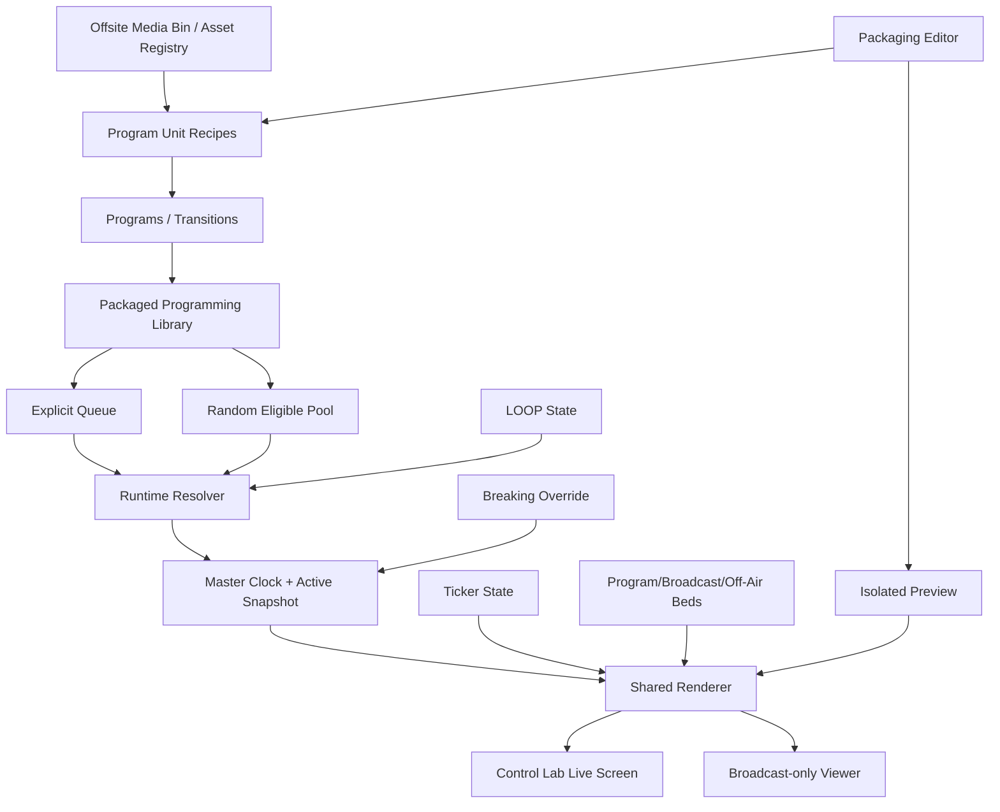

# FRNN Broadcast Control Lab  
## Modular Combinatorial Design

This document is the **current locked design state and Core Concept Registry** for the Broadcast Control Lab. It is not the chronological story; that role belongs to the companion narrative.

The design follows one governing question:

> **What changes because this concept exists?**

Every concept record identifies its causal effects, dependencies, exclusions, invariants, test obligations, and source liner notes. Names and tags are not treated as evidence that the behavior works.

---

# 1. Authority and Reality

## Design authority

- Rounds 1–9 are **LOCKED**.
- Assistant recommendations are preserved in the narrative but are not authority where the owner chose differently.
- Qualifications remain part of the locked decision.
- Superseded mechanics stay historical and must not be resurrected silently.

## Reality vocabulary

| State | Meaning |
|---|---|
| `SPECULATIVE` | Idea under discussion |
| `DESIGNED` | Intended behavior is owner-approved |
| `IMPLEMENTED` | Present in current source |
| `TESTED` | Meaningfully exercised |
| `VALIDATED` | Evidence supports the underlying design assumption |

A concept may be `DESIGNED_LOCKED` while still being absent from source.

For current software, trust:

```text
runtime behavior
→ current source
→ behavioral tests
→ locked design
→ documentation
```

---

# 2. System Causal Spine



The core runtime resolution is:

```text
explicit queue has next?
    YES → select explicit next
    NO  → LOOP?
            OFF → OFF AIR
            ON  → eligible pool?
                    empty → OFF AIR
                    nonempty → one authoritative random selection
```

---

# 3. Tag / Context Grammar

Tags use namespaced `dimension:value` forms. They are designed for intersection, not decoration.

## Primary dimensions

| Dimension | Examples | Question answered |
|---|---|---|
| `layer:` | `surface`, `packaging`, `media`, `runtime`, `audio`, `overlay`, `module`, `portability`, `process`, `agent` | Where does it operate? |
| `scope:` | `v1`, `v1-design`, `experiment`, `next`, `unresolved` | When is it expected? |
| `authority:` | `owner-locked`, `producer`, `server`, `interrupt`, `urgent` | Who/what may cause the change? |
| `timing:` | `authoring`, `future`, `now`, `boundary`, `continuous` | When does the effect apply? |
| `mutability:` | `persistent`, `editable-future`, `immutable-run`, `temporary` | What can change and when? |
| `media:` | `video`, `audio`, `graphic`, `references-only` | Which media domain? |
| `state:` | `off-air`, `loop`, `override`, `emergency` | Which runtime state? |
| `risk:` | `propagation`, `sync`, `media`, `file-collision`, `authority` | What can go wrong? |
| `reality:` | `designed`, `implemented`, `reverify`, `unvalidated` | What evidence exists? |
| `module-kind:` | `control`, `packaging` | Which extension boundary? |

## Context intersections

Examples:

```text
layer:runtime + timing:now + mutability:immutable-run
→ Active Playback Snapshot
```

```text
layer:overlay + authority:urgent + timing:immediate
→ Emergency Ticker
```

```text
layer:module + module-kind:packaging + media:graphic
→ Graphics v1 Packaging Module
```

```text
layer:portability + media:references-only + authority:owner-confirmation
→ Program Pack Import Preview
```

## Context query notation

The documents support lightweight logical query language in prose or script:

```text
WITH layer:audio
AND scope:v1
AND NOT reality:validated
```

```text
TRACE BCL.RUNTIME.LOOP
```

```text
IMPACT BCL.PKG.UNIT
```

```text
NOTES FOR BCL.OVERRIDE.BREAKING
```

---

# 4. Machine-readable Marker Contract

Each concept begins with an HTML comment:

```html
<!-- @concept-example id="BCL.PKG.PROGRAM"
     status="LOCKED"
     reality="DESIGNED_LOCKED"
     layer="packaging"
     tags="layer:packaging,kind:program"
     traces="LN-101,LN-602"
     deps="BCL.PKG.UNIT"
     relations="COMPOSED_OF:BCL.PKG.UNIT" -->
```

The following YAML block is the human-readable full record.

The narrative uses corresponding `@ln` markers. The trace guide explains both.

---

# 5. Concept Registry


<!-- @concept id="BCL.SYSTEM.ALL" status="LOCKED" reality="DESIGNED_LOCKED" layer="system" tags="layer:system,authority:owner-locked,scope:v1,causality:end-to-end" traces="LN-001,LN-011,LN-519,LN-999" deps="" relations="CONTAINS:BCL.SURFACE.CONTROL_LAB,CONTAINS:BCL.RUNTIME.MASTER_CLOCK,CONTAINS:BCL.PKG.LIBRARY" -->
## BCL.SYSTEM.ALL — Broadcast Control Lab System

```yaml
{
  "concept_id": "BCL.SYSTEM.ALL",
  "canonical_name": "Broadcast Control Lab System",
  "status": "LOCKED",
  "reality": "DESIGNED_LOCKED",
  "scope": "v1-design",
  "layer": "system",
  "definition": "The combined producer, packaging, runtime, viewer, ticker, override, media-reference, audio, and portability architecture defined by locked Design Flow Rounds 1–9.",
  "owns": [
    "system boundaries",
    "cross-subsystem invariants",
    "end-to-end causal path"
  ],
  "does_not_own": [
    "claim that the full design is implemented",
    "player-app mechanics",
    "QR mechanics",
    "full media DAM"
  ],
  "causes": [
    "a Director must reconcile current source against one coherent locked target"
  ],
  "dependencies": [],
  "relations": [
    "CONTAINS:BCL.SURFACE.CONTROL_LAB",
    "CONTAINS:BCL.RUNTIME.MASTER_CLOCK",
    "CONTAINS:BCL.PKG.LIBRARY"
  ],
  "source_liner_notes": [
    "LN-001",
    "LN-011",
    "LN-519",
    "LN-999"
  ],
  "tags": [
    "layer:system",
    "authority:owner-locked",
    "scope:v1",
    "causality:end-to-end"
  ],
  "invariants": [
    "Design lock is not implementation evidence.",
    "Every state field must cause an observable downstream difference."
  ],
  "test_obligations": [
    "End-to-end operator action → persisted state → runtime rule → viewer result."
  ]
}
```

**Causal reading:** a Director must reconcile current source against one coherent locked target


<!-- @concept id="BCL.SURFACE.CONTROL_LAB" status="LOCKED" reality="DESIGNED_LOCKED" layer="surface" tags="layer:surface,device:desktop,authority:producer,scope:v1" traces="LN-001,LN-011,LN-501,LN-513,LN-519" deps="BCL.SURFACE.PRODUCER_CONSOLE,BCL.SURFACE.LIVE_SCREEN,BCL.SURFACE.PACKAGING_EDITOR" relations="CONTAINS:BCL.SURFACE.PRODUCER_CONSOLE,CONTAINS:BCL.SURFACE.LIVE_SCREEN,CONTAINS:BCL.SURFACE.PACKAGING_EDITOR" -->
## BCL.SURFACE.CONTROL_LAB — Broadcast Control Lab

```yaml
{
  "concept_id": "BCL.SURFACE.CONTROL_LAB",
  "canonical_name": "Broadcast Control Lab",
  "status": "LOCKED",
  "reality": "DESIGNED_LOCKED",
  "scope": "v1",
  "layer": "surface",
  "definition": "Desktop producer workstation containing the left producer console and a right column with two actual screens: Live Broadcast and Packaging Editor.",
  "owns": [
    "desktop workspace composition",
    "coordination of producer console and two screens"
  ],
  "does_not_own": [
    "public receiver UX",
    "mobile producer layout",
    "independent playback clock"
  ],
  "causes": [
    "operator can control the channel while observing output and packaging future content"
  ],
  "dependencies": [
    "BCL.SURFACE.PRODUCER_CONSOLE",
    "BCL.SURFACE.LIVE_SCREEN",
    "BCL.SURFACE.PACKAGING_EDITOR"
  ],
  "relations": [
    "CONTAINS:BCL.SURFACE.PRODUCER_CONSOLE",
    "CONTAINS:BCL.SURFACE.LIVE_SCREEN",
    "CONTAINS:BCL.SURFACE.PACKAGING_EDITOR"
  ],
  "source_liner_notes": [
    "LN-001",
    "LN-011",
    "LN-501",
    "LN-513",
    "LN-519"
  ],
  "tags": [
    "layer:surface",
    "device:desktop",
    "authority:producer",
    "scope:v1"
  ],
  "invariants": [
    "Desktop-only in v1.",
    "Embedded live screen uses authoritative shared renderer."
  ],
  "test_obligations": [
    "Opening the route exposes all three regions without creating a second clock."
  ]
}
```

**Causal reading:** operator can control the channel while observing output and packaging future content


<!-- @concept id="BCL.SURFACE.PRODUCER_CONSOLE" status="LOCKED" reality="DESIGNED_LOCKED" layer="surface" tags="layer:surface,authority:producer,timing:future-control,scope:v1" traces="LN-501,LN-502,LN-503,LN-504,LN-509,LN-510,LN-511" deps="BCL.PKG.LIBRARY,BCL.RUNTIME.QUEUE,BCL.MODULE.CONTROL.REGION,BCL.OVERRIDE.BREAKING" relations="OPERATES:BCL.RUNTIME.QUEUE,OPERATES:BCL.RUNTIME.LOOP,HOSTS:BCL.MODULE.CONTROL.REGION" -->
## BCL.SURFACE.PRODUCER_CONSOLE — Producer Console

```yaml
{
  "concept_id": "BCL.SURFACE.PRODUCER_CONSOLE",
  "canonical_name": "Producer Console",
  "status": "LOCKED",
  "reality": "DESIGNED_LOCKED",
  "scope": "v1",
  "layer": "surface",
  "definition": "Left-side operational region for NOW/NEXT, library, queue, normal Broadcast controls, Control Module region, and protected Breaking Override.",
  "owns": [
    "future scheduling controls",
    "library/queue interaction",
    "operator state visibility"
  ],
  "does_not_own": [
    "Unit composition",
    "public audience presentation",
    "client-side random choice"
  ],
  "causes": [
    "operator actions mutate authoritative future or exceptional state"
  ],
  "dependencies": [
    "BCL.PKG.LIBRARY",
    "BCL.RUNTIME.QUEUE",
    "BCL.MODULE.CONTROL.REGION",
    "BCL.OVERRIDE.BREAKING"
  ],
  "relations": [
    "OPERATES:BCL.RUNTIME.QUEUE",
    "OPERATES:BCL.RUNTIME.LOOP",
    "HOSTS:BCL.MODULE.CONTROL.REGION"
  ],
  "source_liner_notes": [
    "LN-501",
    "LN-502",
    "LN-503",
    "LN-504",
    "LN-509",
    "LN-510",
    "LN-511"
  ],
  "tags": [
    "layer:surface",
    "authority:producer",
    "timing:future-control",
    "scope:v1"
  ],
  "invariants": [
    "Ordinary controls do not interrupt NOW.",
    "Breaking Override is visually and behaviorally distinct."
  ],
  "test_obligations": [
    "Queue edit changes future state while current snapshot remains stable."
  ]
}
```

**Causal reading:** operator actions mutate authoritative future or exceptional state


<!-- @concept id="BCL.SURFACE.LIVE_SCREEN" status="LOCKED" reality="DESIGNED_LOCKED" layer="surface" tags="layer:surface,audience:embedded,timing:now,renderer:shared" traces="LN-003,LN-514,LN-519,LN-722" deps="BCL.RENDERER.SHARED,BCL.RUNTIME.MASTER_CLOCK" relations="USES:BCL.RENDERER.SHARED,OBSERVES:BCL.RUNTIME.ACTIVE_SNAPSHOT" -->
## BCL.SURFACE.LIVE_SCREEN — Live Broadcast Screen

```yaml
{
  "concept_id": "BCL.SURFACE.LIVE_SCREEN",
  "canonical_name": "Live Broadcast Screen",
  "status": "LOCKED",
  "reality": "DESIGNED_LOCKED",
  "scope": "v1",
  "layer": "surface",
  "definition": "Top-right screen showing the actual authoritative Broadcast output inside the Control Lab.",
  "owns": [
    "embedded audience-facing rendering",
    "observable live state"
  ],
  "does_not_own": [
    "independent preview clock",
    "producer editing controls",
    "persistent audience elapsed counter"
  ],
  "causes": [
    "producer sees the same channel state as remote viewers"
  ],
  "dependencies": [
    "BCL.RENDERER.SHARED",
    "BCL.RUNTIME.MASTER_CLOCK"
  ],
  "relations": [
    "USES:BCL.RENDERER.SHARED",
    "OBSERVES:BCL.RUNTIME.ACTIVE_SNAPSHOT"
  ],
  "source_liner_notes": [
    "LN-003",
    "LN-514",
    "LN-519",
    "LN-722"
  ],
  "tags": [
    "layer:surface",
    "audience:embedded",
    "timing:now",
    "renderer:shared"
  ],
  "invariants": [
    "Same authoritative state as /broadcast.",
    "No independent timeline."
  ],
  "test_obligations": [
    "Control Lab screen and remote viewer agree on item, offset, ticker, bed, and override state."
  ]
}
```

**Causal reading:** producer sees the same channel state as remote viewers


<!-- @concept id="BCL.SURFACE.PACKAGING_EDITOR" status="LOCKED" reality="DESIGNED_LOCKED" layer="surface" tags="layer:surface,mode:authoring,timing:future,preview:isolated" traces="LN-505,LN-506,LN-519,LN-520,LN-701,LN-720" deps="BCL.PKG.PROGRAM,BCL.PKG.UNIT,BCL.PREVIEW.ISOLATION,BCL.MODULE.PACKAGING.GRAPHICS_V1" relations="EDITS:BCL.PKG.PROGRAM,EDITS:BCL.PKG.UNIT,HOSTS:BCL.MODULE.PACKAGING.GRAPHICS_V1" -->
## BCL.SURFACE.PACKAGING_EDITOR — Packaging Editor Screen

```yaml
{
  "concept_id": "BCL.SURFACE.PACKAGING_EDITOR",
  "canonical_name": "Packaging Editor Screen",
  "status": "LOCKED",
  "reality": "DESIGNED_LOCKED",
  "scope": "v1",
  "layer": "surface",
  "definition": "Persistent lower-right screen for Program overview, selected-Unit editing, media selection, audio layers, Packaging Modules, previews, save, revert, and undo.",
  "owns": [
    "future package authoring",
    "Program/Unit assembly",
    "isolated preview controls"
  ],
  "does_not_own": [
    "live queue authority",
    "on-air mutation",
    "full nonlinear timeline"
  ],
  "causes": [
    "future definitions can be built while the current Broadcast continues"
  ],
  "dependencies": [
    "BCL.PKG.PROGRAM",
    "BCL.PKG.UNIT",
    "BCL.PREVIEW.ISOLATION",
    "BCL.MODULE.PACKAGING.GRAPHICS_V1"
  ],
  "relations": [
    "EDITS:BCL.PKG.PROGRAM",
    "EDITS:BCL.PKG.UNIT",
    "HOSTS:BCL.MODULE.PACKAGING.GRAPHICS_V1"
  ],
  "source_liner_notes": [
    "LN-505",
    "LN-506",
    "LN-519",
    "LN-520",
    "LN-701",
    "LN-720"
  ],
  "tags": [
    "layer:surface",
    "mode:authoring",
    "timing:future",
    "preview:isolated"
  ],
  "invariants": [
    "Preview never changes on-air state.",
    "Saving an on-air item changes future use only."
  ],
  "test_obligations": [
    "Edit and preview Unit N while different content remains on air unchanged."
  ]
}
```

**Causal reading:** future definitions can be built while the current Broadcast continues


<!-- @concept id="BCL.SURFACE.BROADCAST_VIEWER" status="LOCKED" reality="IMPLEMENTED_EXPERIMENTAL_REVERIFY" layer="surface" tags="layer:surface,audience:remote,device:cross-device,reality:reverify" traces="LN-003,LN-008,LN-513,LN-514,LN-722" deps="BCL.RENDERER.SHARED,BCL.RUNTIME.MASTER_CLOCK" relations="USES:BCL.RENDERER.SHARED,READS:BCL.RUNTIME.MASTER_CLOCK" -->
## BCL.SURFACE.BROADCAST_VIEWER — Broadcast-only Viewer

```yaml
{
  "concept_id": "BCL.SURFACE.BROADCAST_VIEWER",
  "canonical_name": "Broadcast-only Viewer",
  "status": "LOCKED",
  "reality": "IMPLEMENTED_EXPERIMENTAL_REVERIFY",
  "scope": "v1",
  "layer": "surface",
  "definition": "Lightweight receiver route, historically /broadcast, intended for phones, tablets, and other computers while the producer Control Lab remains desktop-only.",
  "owns": [
    "remote audience rendering",
    "late join behavior"
  ],
  "does_not_own": [
    "producer controls",
    "local random selection",
    "mobile Packaging Editor"
  ],
  "causes": [
    "cross-machine proof of one shared channel"
  ],
  "dependencies": [
    "BCL.RENDERER.SHARED",
    "BCL.RUNTIME.MASTER_CLOCK"
  ],
  "relations": [
    "USES:BCL.RENDERER.SHARED",
    "READS:BCL.RUNTIME.MASTER_CLOCK"
  ],
  "source_liner_notes": [
    "LN-003",
    "LN-008",
    "LN-513",
    "LN-514",
    "LN-722"
  ],
  "tags": [
    "layer:surface",
    "audience:remote",
    "device:cross-device",
    "reality:reverify"
  ],
  "invariants": [
    "Late join seeks current offset.",
    "Viewer starts no authoritative state locally."
  ],
  "test_obligations": [
    "Second device joins same item and offset within tolerance."
  ]
}
```

**Causal reading:** cross-machine proof of one shared channel


<!-- @concept id="BCL.SURFACE.TICKER_MANAGER" status="LOCKED" reality="DESIGNED_LOCKED" layer="surface" tags="layer:surface,subsystem:ticker,mode:management,authority:producer" traces="LN-410,LN-515" deps="BCL.TICKER.DATABASE" relations="MANAGES:BCL.TICKER.DATABASE" -->
## BCL.SURFACE.TICKER_MANAGER — Ticker Management Surface

```yaml
{
  "concept_id": "BCL.SURFACE.TICKER_MANAGER",
  "canonical_name": "Ticker Management Surface",
  "status": "LOCKED",
  "reality": "DESIGNED_LOCKED",
  "scope": "v1",
  "layer": "surface",
  "definition": "Dedicated route for creating, editing, ordering, enabling, disabling, and deleting persisted ticker messages.",
  "owns": [
    "ticker CRUD",
    "manual order",
    "content maintenance"
  ],
  "does_not_own": [
    "live media timing",
    "full generic CMS",
    "public viewer state"
  ],
  "causes": [
    "ticker module can remain compact while message management stays complete"
  ],
  "dependencies": [
    "BCL.TICKER.DATABASE"
  ],
  "relations": [
    "MANAGES:BCL.TICKER.DATABASE"
  ],
  "source_liner_notes": [
    "LN-410",
    "LN-515"
  ],
  "tags": [
    "layer:surface",
    "subsystem:ticker",
    "mode:management",
    "authority:producer"
  ],
  "invariants": [
    "Management actions persist authoritatively.",
    "Live Program clock remains unchanged."
  ],
  "test_obligations": [
    "CRUD changes public crawl without restarting current media."
  ]
}
```

**Causal reading:** ticker module can remain compact while message management stays complete


<!-- @concept id="BCL.PKG.LIBRARY" status="LOCKED" reality="DESIGNED_LOCKED" layer="packaging" tags="layer:packaging,lifecycle:persistent,mutability:editable-future,scope:v1" traces="LN-009,LN-101,LN-102,LN-103,LN-502" deps="BCL.PKG.PROGRAM,BCL.PKG.TRANSITION,BCL.PKG.UNIT" relations="SUPPLIES:BCL.RUNTIME.QUEUE,SUPPLIES:BCL.RUNTIME.RANDOM_POOL,EXPORTS_VIA:BCL.PORTABLE.PROGRAM_PACK" -->
## BCL.PKG.LIBRARY — Packaged Programming Library

```yaml
{
  "concept_id": "BCL.PKG.LIBRARY",
  "canonical_name": "Packaged Programming Library",
  "status": "LOCKED",
  "reality": "DESIGNED_LOCKED",
  "scope": "v1",
  "layer": "packaging",
  "definition": "Persistent reusable collection of Programs, Transitions, and directly airable Units, separate from the ordered queue.",
  "owns": [
    "definition persistence",
    "selection for queue",
    "reuse",
    "import/export selection"
  ],
  "does_not_own": [
    "current schedule order",
    "raw media storage",
    "active playback instance"
  ],
  "causes": [
    "objects may exist, be reused, and be loop-eligible without being scheduled"
  ],
  "dependencies": [
    "BCL.PKG.PROGRAM",
    "BCL.PKG.TRANSITION",
    "BCL.PKG.UNIT"
  ],
  "relations": [
    "SUPPLIES:BCL.RUNTIME.QUEUE",
    "SUPPLIES:BCL.RUNTIME.RANDOM_POOL",
    "EXPORTS_VIA:BCL.PORTABLE.PROGRAM_PACK"
  ],
  "source_liner_notes": [
    "LN-009",
    "LN-101",
    "LN-102",
    "LN-103",
    "LN-502"
  ],
  "tags": [
    "layer:packaging",
    "lifecycle:persistent",
    "mutability:editable-future",
    "scope:v1"
  ],
  "invariants": [
    "Library is not queue.",
    "Playback does not consume objects."
  ],
  "test_obligations": [
    "Create object, refresh, reuse in multiple queue/program contexts."
  ]
}
```

**Causal reading:** objects may exist, be reused, and be loop-eligible without being scheduled


<!-- @concept id="BCL.PKG.PROGRAM" status="LOCKED" reality="DESIGNED_LOCKED" layer="packaging" tags="layer:packaging,kind:program,composition:units,identity:audience-facing" traces="LN-101,LN-104,LN-602,LN-701,LN-702" deps="BCL.PKG.UNIT,BCL.RUNTIME.PROGRAM_CLOCK,BCL.AUDIO.PROGRAM_BED" relations="COMPOSED_OF:BCL.PKG.UNIT,MAY_USE:BCL.AUDIO.PROGRAM_BED,QUEUED_BY:BCL.RUNTIME.QUEUE" -->
## BCL.PKG.PROGRAM — Program

```yaml
{
  "concept_id": "BCL.PKG.PROGRAM",
  "canonical_name": "Program",
  "status": "LOCKED",
  "reality": "DESIGNED_LOCKED",
  "scope": "v1",
  "layer": "packaging",
  "definition": "Audience-facing programming object composed of an ordered sequence of Program Units and optional Program Bed rules.",
  "owns": [
    "Program title/identity",
    "ordered Unit composition",
    "Program-level audio relationship",
    "whole-Program clock presentation"
  ],
  "does_not_own": [
    "raw media bytes",
    "queue position",
    "Broadcast-wide bed authority"
  ],
  "causes": [
    "several short Units may be experienced as one coherent Program"
  ],
  "dependencies": [
    "BCL.PKG.UNIT",
    "BCL.RUNTIME.PROGRAM_CLOCK",
    "BCL.AUDIO.PROGRAM_BED"
  ],
  "relations": [
    "COMPOSED_OF:BCL.PKG.UNIT",
    "MAY_USE:BCL.AUDIO.PROGRAM_BED",
    "QUEUED_BY:BCL.RUNTIME.QUEUE"
  ],
  "source_liner_notes": [
    "LN-101",
    "LN-104",
    "LN-602",
    "LN-701",
    "LN-702"
  ],
  "tags": [
    "layer:packaging",
    "kind:program",
    "composition:units",
    "identity:audience-facing"
  ],
  "invariants": [
    "Program identity persists across Unit boundaries.",
    "Empty Program is valid during authoring but not live-ready."
  ],
  "test_obligations": [
    "Program clock maps elapsed time to correct Unit and offset."
  ]
}
```

**Causal reading:** several short Units may be experienced as one coherent Program


<!-- @concept id="BCL.PKG.TRANSITION" status="LOCKED" reality="DESIGNED_LOCKED" layer="packaging" tags="layer:packaging,kind:transition,placement:anywhere,composition:units" traces="LN-104,LN-208,LN-616" deps="BCL.PKG.UNIT" relations="COMPOSED_OF:BCL.PKG.UNIT,QUEUED_BY:BCL.RUNTIME.QUEUE" -->
## BCL.PKG.TRANSITION — Transition

```yaml
{
  "concept_id": "BCL.PKG.TRANSITION",
  "canonical_name": "Transition",
  "status": "LOCKED",
  "reality": "DESIGNED_LOCKED",
  "scope": "v1",
  "layer": "packaging",
  "definition": "Semantic packaged kind used for station IDs, bumpers, interstitials, or short compositions; it may contain one Unit or a short ordered Unit set.",
  "owns": [
    "semantic identity as Transition"
  ],
  "does_not_own": [
    "automatic insertion",
    "separate playback engine",
    "fixed position between Programs"
  ],
  "causes": [
    "operator and future rules can distinguish a Transition from a Program without duplicating rendering machinery"
  ],
  "dependencies": [
    "BCL.PKG.UNIT"
  ],
  "relations": [
    "COMPOSED_OF:BCL.PKG.UNIT",
    "QUEUED_BY:BCL.RUNTIME.QUEUE"
  ],
  "source_liner_notes": [
    "LN-104",
    "LN-208",
    "LN-616"
  ],
  "tags": [
    "layer:packaging",
    "kind:transition",
    "placement:anywhere",
    "composition:units"
  ],
  "invariants": [
    "Transition kind is separate from media type.",
    "May be manually queued anywhere."
  ],
  "test_obligations": [
    "Kind persists and renders through shared engine."
  ]
}
```

**Causal reading:** operator and future rules can distinguish a Transition from a Program without duplicating rendering machinery


<!-- @concept id="BCL.PKG.UNIT" status="LOCKED" reality="DESIGNED_LOCKED" layer="packaging" tags="layer:packaging,granularity:unit,target-duration:under-5m,recipe:references" traces="LN-601,LN-602,LN-603,LN-604,LN-605,LN-618" deps="BCL.MEDIA.ASSET_REGISTRY,BCL.AUDIO.UNIT_LAYER,BCL.TEXT.SUBTITLE,BCL.RUNTIME.UNIT_BOUNDARY" relations="REFERENCES:BCL.MEDIA.ASSET_REGISTRY,MAY_BELONG_TO:BCL.PKG.PROGRAM,MAY_AIR_DIRECTLY:BCL.RUNTIME.QUEUE" -->
## BCL.PKG.UNIT — Program Unit

```yaml
{
  "concept_id": "BCL.PKG.UNIT",
  "canonical_name": "Program Unit",
  "status": "LOCKED",
  "reality": "DESIGNED_LOCKED",
  "scope": "v1",
  "layer": "packaging",
  "definition": "Reusable short playable recipe containing zero/one video, layered audio, trims, subtitles, Packaging Module recipe, duration, and boundary behavior.",
  "owns": [
    "local media composition",
    "Unit duration",
    "Unit-level bed relationship",
    "subtitles",
    "boundary to next Unit"
  ],
  "does_not_own": [
    "embedded media binaries",
    "multiple simultaneous video layers",
    "whole-channel authority"
  ],
  "causes": [
    "small source material can be recombined into fresh Programs"
  ],
  "dependencies": [
    "BCL.MEDIA.ASSET_REGISTRY",
    "BCL.AUDIO.UNIT_LAYER",
    "BCL.TEXT.SUBTITLE",
    "BCL.RUNTIME.UNIT_BOUNDARY"
  ],
  "relations": [
    "REFERENCES:BCL.MEDIA.ASSET_REGISTRY",
    "MAY_BELONG_TO:BCL.PKG.PROGRAM",
    "MAY_AIR_DIRECTLY:BCL.RUNTIME.QUEUE"
  ],
  "source_liner_notes": [
    "LN-601",
    "LN-602",
    "LN-603",
    "LN-604",
    "LN-605",
    "LN-618"
  ],
  "tags": [
    "layer:packaging",
    "granularity:unit",
    "target-duration:under-5m",
    "recipe:references"
  ],
  "invariants": [
    "0 or 1 video source.",
    "Missing required asset blocks live use."
  ],
  "test_obligations": [
    "Same source assets support duplicated Units with different recipes."
  ]
}
```

**Causal reading:** small source material can be recombined into fresh Programs


<!-- @concept id="BCL.PKG.UNIT_LIBRARY" status="LOCKED" reality="DESIGNED_LOCKED" layer="packaging" tags="layer:packaging,collection:unit,reuse:many-programs" traces="LN-603,LN-604,LN-703" deps="BCL.PKG.UNIT" relations="SUPPLIES:BCL.PKG.PROGRAM,SUPPLIES:BCL.PKG.TRANSITION" -->
## BCL.PKG.UNIT_LIBRARY — Program Unit Library

```yaml
{
  "concept_id": "BCL.PKG.UNIT_LIBRARY",
  "canonical_name": "Program Unit Library",
  "status": "LOCKED",
  "reality": "DESIGNED_LOCKED",
  "scope": "v1",
  "layer": "packaging",
  "definition": "Persistent reusable collection of Unit definitions independent of Program membership.",
  "owns": [
    "Unit reuse",
    "selection of existing Units"
  ],
  "does_not_own": [
    "source media bytes",
    "Program ordering"
  ],
  "causes": [
    "one Unit may serve several Programs and Transitions"
  ],
  "dependencies": [
    "BCL.PKG.UNIT"
  ],
  "relations": [
    "SUPPLIES:BCL.PKG.PROGRAM",
    "SUPPLIES:BCL.PKG.TRANSITION"
  ],
  "source_liner_notes": [
    "LN-603",
    "LN-604",
    "LN-703"
  ],
  "tags": [
    "layer:packaging",
    "collection:unit",
    "reuse:many-programs"
  ],
  "invariants": [
    "Unit identity is stable across references.",
    "Shared edit consequences are visible."
  ],
  "test_obligations": [
    "Reference one Unit from multiple Programs and exercise edit guard."
  ]
}
```

**Causal reading:** one Unit may serve several Programs and Transitions


<!-- @concept id="BCL.PKG.SHARED_EDIT_GUARD" status="LOCKED" reality="DESIGNED_LOCKED" layer="packaging" tags="layer:packaging,risk:propagation,authority:owner-choice" traces="LN-704" deps="BCL.PKG.UNIT_LIBRARY,BCL.PKG.UNIT_DUPLICATION" relations="PROTECTS:BCL.PKG.UNIT_LIBRARY" -->
## BCL.PKG.SHARED_EDIT_GUARD — Shared Unit Edit Guard

```yaml
{
  "concept_id": "BCL.PKG.SHARED_EDIT_GUARD",
  "canonical_name": "Shared Unit Edit Guard",
  "status": "LOCKED",
  "reality": "DESIGNED_LOCKED",
  "scope": "v1",
  "layer": "packaging",
  "definition": "When editing a Unit referenced by multiple packages, require EDIT SHARED UNIT or DUPLICATE & EDIT.",
  "owns": [
    "explicit propagation decision"
  ],
  "does_not_own": [
    "silent copy-on-write",
    "silent global mutation"
  ],
  "causes": [
    "owner understands which Programs will change"
  ],
  "dependencies": [
    "BCL.PKG.UNIT_LIBRARY",
    "BCL.PKG.UNIT_DUPLICATION"
  ],
  "relations": [
    "PROTECTS:BCL.PKG.UNIT_LIBRARY"
  ],
  "source_liner_notes": [
    "LN-704"
  ],
  "tags": [
    "layer:packaging",
    "risk:propagation",
    "authority:owner-choice"
  ],
  "invariants": [
    "No hidden propagation."
  ],
  "test_obligations": [
    "Shared reference count changes prompt behavior."
  ]
}
```

**Causal reading:** owner understands which Programs will change


<!-- @concept id="BCL.PKG.UNIT_DUPLICATION" status="LOCKED" reality="DESIGNED_LOCKED" layer="packaging" tags="layer:packaging,operation:duplicate,media:no-copy" traces="LN-609,LN-719" deps="BCL.PKG.UNIT,BCL.MEDIA.ASSET_REGISTRY" relations="COPIES_RECIPE_OF:BCL.PKG.UNIT" -->
## BCL.PKG.UNIT_DUPLICATION — Unit Recipe Duplication

```yaml
{
  "concept_id": "BCL.PKG.UNIT_DUPLICATION",
  "canonical_name": "Unit Recipe Duplication",
  "status": "LOCKED",
  "reality": "DESIGNED_LOCKED",
  "scope": "v1",
  "layer": "packaging",
  "definition": "Create a new Unit ID with copied recipe fields and shared source-asset references.",
  "owns": [
    "independent derivative recipe creation"
  ],
  "does_not_own": [
    "media-file duplication"
  ],
  "causes": [
    "light variation through trims, audio, graphics, subtitles, and boundary changes"
  ],
  "dependencies": [
    "BCL.PKG.UNIT",
    "BCL.MEDIA.ASSET_REGISTRY"
  ],
  "relations": [
    "COPIES_RECIPE_OF:BCL.PKG.UNIT"
  ],
  "source_liner_notes": [
    "LN-609",
    "LN-719"
  ],
  "tags": [
    "layer:packaging",
    "operation:duplicate",
    "media:no-copy"
  ],
  "invariants": [
    "New Unit may diverge without changing source Unit."
  ],
  "test_obligations": [
    "Duplicate then edit leaves original recipe unchanged."
  ]
}
```

**Causal reading:** light variation through trims, audio, graphics, subtitles, and boundary changes


<!-- @concept id="BCL.MEDIA.ASSET_REGISTRY" status="LOCKED" reality="DESIGNED_LOCKED_PARTIAL_ADAPTER_EXISTS_REVERIFY" layer="media" tags="layer:media,storage:offsite,identity:stable-id,ui:minimal-registry" traces="LN-612,LN-613,LN-618,LN-810,LN-902,LN-906" deps="" relations="SUPPLIES:BCL.PKG.UNIT,SUPPLIES:BCL.AUDIO.BROADCAST_BED,MANIFESTED_BY:BCL.PORTABLE.PROGRAM_PACK" -->
## BCL.MEDIA.ASSET_REGISTRY — Offsite Media Asset Registry

```yaml
{
  "concept_id": "BCL.MEDIA.ASSET_REGISTRY",
  "canonical_name": "Offsite Media Asset Registry",
  "status": "LOCKED",
  "reality": "DESIGNED_LOCKED_PARTIAL_ADAPTER_EXISTS_REVERIFY",
  "scope": "v1",
  "layer": "media",
  "definition": "Registry mapping stable video/audio/graphic asset IDs to current offsite delivery references and availability state.",
  "owns": [
    "asset identity",
    "delivery-location resolution",
    "basic asset metadata/status"
  ],
  "does_not_own": [
    "full DAM",
    "required v1 upload pipeline",
    "package recipes"
  ],
  "causes": [
    "storage providers can change without rewriting packages"
  ],
  "dependencies": [],
  "relations": [
    "SUPPLIES:BCL.PKG.UNIT",
    "SUPPLIES:BCL.AUDIO.BROADCAST_BED",
    "MANIFESTED_BY:BCL.PORTABLE.PROGRAM_PACK"
  ],
  "source_liner_notes": [
    "LN-612",
    "LN-613",
    "LN-618",
    "LN-810",
    "LN-902",
    "LN-906"
  ],
  "tags": [
    "layer:media",
    "storage:offsite",
    "identity:stable-id",
    "ui:minimal-registry"
  ],
  "invariants": [
    "Packages store stable IDs, not provider URLs.",
    "Unavailable assets are visible before airtime."
  ],
  "test_obligations": [
    "Changing resolved URL preserves package identity."
  ]
}
```

**Causal reading:** storage providers can change without rewriting packages


<!-- @concept id="BCL.MEDIA.TIMECODE_MAP" status="LOCKED" reality="DESIGNED_LOCKED" layer="media" tags="layer:media,media:audio-video,sync:optional,mapping:fixed-offset" traces="LN-606,LN-707" deps="BCL.MEDIA.ASSET_REGISTRY" relations="RELATES:BCL.MEDIA.AUDIO,RELATES:BCL.MEDIA.VIDEO" -->
## BCL.MEDIA.TIMECODE_MAP — Audio↔Video Source Timecode Map

```yaml
{
  "concept_id": "BCL.MEDIA.TIMECODE_MAP",
  "canonical_name": "Audio↔Video Source Timecode Map",
  "status": "LOCKED",
  "reality": "DESIGNED_LOCKED",
  "scope": "v1",
  "layer": "media",
  "definition": "Optional stored relationship between an audio source and a video source timecode, exposed through ALIGN TO SOURCE while preserving intentional mismatch.",
  "owns": [
    "known source alignment relation"
  ],
  "does_not_own": [
    "automatic sync inference",
    "complex drift mapping in v1"
  ],
  "causes": [
    "repeated packaging can reuse known synchronization instead of rediscovering it"
  ],
  "dependencies": [
    "BCL.MEDIA.ASSET_REGISTRY"
  ],
  "relations": [
    "RELATES:BCL.MEDIA.AUDIO",
    "RELATES:BCL.MEDIA.VIDEO"
  ],
  "source_liner_notes": [
    "LN-606",
    "LN-707"
  ],
  "tags": [
    "layer:media",
    "media:audio-video",
    "sync:optional",
    "mapping:fixed-offset"
  ],
  "invariants": [
    "Alignment is visible and optional."
  ],
  "test_obligations": [
    "Known fixed offset computes corresponding audio segment for video trim."
  ]
}
```

**Causal reading:** repeated packaging can reuse known synchronization instead of rediscovering it


<!-- @concept id="BCL.MEDIA.TRIM" status="LOCKED" reality="DESIGNED_LOCKED" layer="media" tags="layer:media,operation:trim,destructive:false" traces="LN-608,LN-708" deps="BCL.MEDIA.ASSET_REGISTRY" relations="CONFIGURES:BCL.PKG.UNIT" -->
## BCL.MEDIA.TRIM — Nondestructive Media Trim

```yaml
{
  "concept_id": "BCL.MEDIA.TRIM",
  "canonical_name": "Nondestructive Media Trim",
  "status": "LOCKED",
  "reality": "DESIGNED_LOCKED",
  "scope": "v1",
  "layer": "media",
  "definition": "Store source IN/OUT values in the Unit recipe using scrubber handles and exact time fields.",
  "owns": [
    "source section selection"
  ],
  "does_not_own": [
    "rendering duplicate shortened files"
  ],
  "causes": [
    "one source can support many Units"
  ],
  "dependencies": [
    "BCL.MEDIA.ASSET_REGISTRY"
  ],
  "relations": [
    "CONFIGURES:BCL.PKG.UNIT"
  ],
  "source_liner_notes": [
    "LN-608",
    "LN-708"
  ],
  "tags": [
    "layer:media",
    "operation:trim",
    "destructive:false"
  ],
  "invariants": [
    "Source asset remains unchanged."
  ],
  "test_obligations": [
    "Trim values produce expected preview duration and source offset."
  ]
}
```

**Causal reading:** one source can support many Units


<!-- @concept id="BCL.MEDIA.AVAILABILITY_GUARD" status="LOCKED" reality="DESIGNED_LOCKED" layer="media" tags="layer:media,failure:visible,gate:queue" traces="LN-614,LN-905" deps="BCL.MEDIA.ASSET_REGISTRY,BCL.PKG.UNIT" relations="BLOCKS:BCL.RUNTIME.QUEUE" -->
## BCL.MEDIA.AVAILABILITY_GUARD — Live Media Availability Guard

```yaml
{
  "concept_id": "BCL.MEDIA.AVAILABILITY_GUARD",
  "canonical_name": "Live Media Availability Guard",
  "status": "LOCKED",
  "reality": "DESIGNED_LOCKED",
  "scope": "v1",
  "layer": "media",
  "definition": "Mark dependent Units unavailable and block live queueing when required assets cannot resolve.",
  "owns": [
    "pre-air failure visibility"
  ],
  "does_not_own": [
    "silent fallback substitution",
    "automatic deletion"
  ],
  "causes": [
    "broken package cannot masquerade as live-ready"
  ],
  "dependencies": [
    "BCL.MEDIA.ASSET_REGISTRY",
    "BCL.PKG.UNIT"
  ],
  "relations": [
    "BLOCKS:BCL.RUNTIME.QUEUE"
  ],
  "source_liner_notes": [
    "LN-614",
    "LN-905"
  ],
  "tags": [
    "layer:media",
    "failure:visible",
    "gate:queue"
  ],
  "invariants": [
    "No unavailable Unit enters live queue."
  ],
  "test_obligations": [
    "Missing asset yields unavailable state and queue rejection."
  ]
}
```

**Causal reading:** broken package cannot masquerade as live-ready


<!-- @concept id="BCL.MEDIA.AUDIO_PRIORITY" status="LOCKED" reality="DESIGNED_LOCKED_UNVALIDATED" layer="media" tags="layer:media,priority:audio,tradeoff:quality-reliability" traces="LN-617" deps="BCL.MEDIA.AUDIO" relations="GUIDES:BCL.RUNTIME.STAGING" -->
## BCL.MEDIA.AUDIO_PRIORITY — Audio-first Quality Priority

```yaml
{
  "concept_id": "BCL.MEDIA.AUDIO_PRIORITY",
  "canonical_name": "Audio-first Quality Priority",
  "status": "LOCKED",
  "reality": "DESIGNED_LOCKED_UNVALIDATED",
  "scope": "v1",
  "layer": "media",
  "definition": "When resource constraints force a tradeoff, preserve audio quality and reliability before maximizing video fidelity.",
  "owns": [
    "tradeoff direction"
  ],
  "does_not_own": [
    "mandate that all audio is lossless",
    "proof of target bitrate"
  ],
  "causes": [
    "delivery experiments evaluate audio failure as the higher-priority defect"
  ],
  "dependencies": [
    "BCL.MEDIA.AUDIO"
  ],
  "relations": [
    "GUIDES:BCL.RUNTIME.STAGING"
  ],
  "source_liner_notes": [
    "LN-617"
  ],
  "tags": [
    "layer:media",
    "priority:audio",
    "tradeoff:quality-reliability"
  ],
  "invariants": [
    "Audio priority does not erase video requirements."
  ],
  "test_obligations": [
    "Simultaneous playback/preview test records audio and video degradation separately."
  ]
}
```

**Causal reading:** delivery experiments evaluate audio failure as the higher-priority defect


<!-- @concept id="BCL.RUNTIME.QUEUE" status="LOCKED" reality="DESIGNED_LOCKED_CURRENT_FIXED_QUEUE_EXISTS_REVERIFY" layer="runtime" tags="layer:runtime,timing:future,order:explicit,mutability:upcoming-only" traces="LN-103,LN-203,LN-204,LN-205,LN-208,LN-209" deps="BCL.PKG.LIBRARY,BCL.RUNTIME.ACTIVE_SNAPSHOT" relations="REFERENCES:BCL.PKG.LIBRARY,PRECEDES:BCL.RUNTIME.RANDOM_FALLBACK" -->
## BCL.RUNTIME.QUEUE — Explicit Programming Queue

```yaml
{
  "concept_id": "BCL.RUNTIME.QUEUE",
  "canonical_name": "Explicit Programming Queue",
  "status": "LOCKED",
  "reality": "DESIGNED_LOCKED_CURRENT_FIXED_QUEUE_EXISTS_REVERIFY",
  "scope": "v1",
  "layer": "runtime",
  "definition": "Ordered references to packaged objects that take priority over random fallback and play before queue-empty rules apply.",
  "owns": [
    "upcoming order",
    "explicit programming priority"
  ],
  "does_not_own": [
    "library persistence",
    "active current item mutation",
    "random-pool membership"
  ],
  "causes": [
    "next Program/Transition selection at normal boundaries"
  ],
  "dependencies": [
    "BCL.PKG.LIBRARY",
    "BCL.RUNTIME.ACTIVE_SNAPSHOT"
  ],
  "relations": [
    "REFERENCES:BCL.PKG.LIBRARY",
    "PRECEDES:BCL.RUNTIME.RANDOM_FALLBACK"
  ],
  "source_liner_notes": [
    "LN-103",
    "LN-203",
    "LN-204",
    "LN-205",
    "LN-208",
    "LN-209"
  ],
  "tags": [
    "layer:runtime",
    "timing:future",
    "order:explicit",
    "mutability:upcoming-only"
  ],
  "invariants": [
    "NOW is not reorderable by ordinary controls.",
    "New entries append by default."
  ],
  "test_obligations": [
    "Add/remove/reorder upcoming leaves current ID/start unchanged."
  ]
}
```

**Causal reading:** next Program/Transition selection at normal boundaries


<!-- @concept id="BCL.RUNTIME.MASTER_CLOCK" status="LOCKED" reality="IMPLEMENTED_EXPERIMENTAL_REVERIFY" layer="runtime" tags="layer:runtime,authority:server,timing:authoritative,sync:multi-client" traces="LN-003,LN-008,LN-305,LN-622,LN-811" deps="BCL.RUNTIME.ACTIVE_SNAPSHOT" relations="DRIVES:BCL.RENDERER.SHARED,DRIVES:BCL.AUDIO.BROADCAST_BED" -->
## BCL.RUNTIME.MASTER_CLOCK — Authoritative Master Clock

```yaml
{
  "concept_id": "BCL.RUNTIME.MASTER_CLOCK",
  "canonical_name": "Authoritative Master Clock",
  "status": "LOCKED",
  "reality": "IMPLEMENTED_EXPERIMENTAL_REVERIFY",
  "scope": "v1",
  "layer": "runtime",
  "definition": "Server/persistence-backed time authority resolving current Program, Unit, bed, start, elapsed, and next state for all viewers.",
  "owns": [
    "authoritative now",
    "late-join offset",
    "boundary evaluation"
  ],
  "does_not_own": [
    "browser-local start authority",
    "client random selection"
  ],
  "causes": [
    "independent clients agree on the same channel state"
  ],
  "dependencies": [
    "BCL.RUNTIME.ACTIVE_SNAPSHOT"
  ],
  "relations": [
    "DRIVES:BCL.RENDERER.SHARED",
    "DRIVES:BCL.AUDIO.BROADCAST_BED"
  ],
  "source_liner_notes": [
    "LN-003",
    "LN-008",
    "LN-305",
    "LN-622",
    "LN-811"
  ],
  "tags": [
    "layer:runtime",
    "authority:server",
    "timing:authoritative",
    "sync:multi-client"
  ],
  "invariants": [
    "One channel time authority.",
    "Every late join resolves server state before playback."
  ],
  "test_obligations": [
    "Two clients opened at different times agree within tolerance."
  ]
}
```

**Causal reading:** independent clients agree on the same channel state


<!-- @concept id="BCL.RUNTIME.PROGRAM_CLOCK" status="LOCKED" reality="DESIGNED_LOCKED" layer="runtime" tags="layer:runtime,timing:program,composition:units,audience:coherent" traces="LN-622,LN-722" deps="BCL.PKG.PROGRAM,BCL.RUNTIME.MASTER_CLOCK" relations="MAPS_TO:BCL.PKG.UNIT" -->
## BCL.RUNTIME.PROGRAM_CLOCK — Continuous Program Clock

```yaml
{
  "concept_id": "BCL.RUNTIME.PROGRAM_CLOCK",
  "canonical_name": "Continuous Program Clock",
  "status": "LOCKED",
  "reality": "DESIGNED_LOCKED",
  "scope": "v1",
  "layer": "runtime",
  "definition": "Continuous Program elapsed domain spanning multiple Unit intervals and mapping current elapsed time to Unit plus Unit offset.",
  "owns": [
    "Program-level continuity",
    "Unit interval mapping"
  ],
  "does_not_own": [
    "persistent audience debug clock",
    "queue-level timing"
  ],
  "causes": [
    "short Units feel like one Program and late join enters correct Unit"
  ],
  "dependencies": [
    "BCL.PKG.PROGRAM",
    "BCL.RUNTIME.MASTER_CLOCK"
  ],
  "relations": [
    "MAPS_TO:BCL.PKG.UNIT"
  ],
  "source_liner_notes": [
    "LN-622",
    "LN-722"
  ],
  "tags": [
    "layer:runtime",
    "timing:program",
    "composition:units",
    "audience:coherent"
  ],
  "invariants": [
    "Unit boundary does not reset Program identity."
  ],
  "test_obligations": [
    "Join at Program time 06:12 resolves expected Unit and 02:12 Unit offset."
  ]
}
```

**Causal reading:** short Units feel like one Program and late join enters correct Unit


<!-- @concept id="BCL.RUNTIME.ACTIVE_SNAPSHOT" status="LOCKED" reality="DESIGNED_LOCKED" layer="runtime" tags="layer:runtime,timing:now,mutability:immutable-run,safety:continuity" traces="LN-106,LN-205,LN-209,LN-721,LN-814" deps="BCL.RUNTIME.MASTER_CLOCK" relations="SNAPSHOTS:BCL.PKG.PROGRAM,PROTECTED_FROM:BCL.SURFACE.PRODUCER_CONSOLE" -->
## BCL.RUNTIME.ACTIVE_SNAPSHOT — Active Playback Snapshot

```yaml
{
  "concept_id": "BCL.RUNTIME.ACTIVE_SNAPSHOT",
  "canonical_name": "Active Playback Snapshot",
  "status": "LOCKED",
  "reality": "DESIGNED_LOCKED",
  "scope": "v1",
  "layer": "runtime",
  "definition": "Stable runtime copy/reference set for what is currently on air, insulated from ordinary definition and future-queue edits.",
  "owns": [
    "current item identity",
    "current run recipe/version",
    "stable start time"
  ],
  "does_not_own": [
    "future package definition",
    "ordinary edit propagation into NOW"
  ],
  "causes": [
    "simultaneous packaging and live operation are safe"
  ],
  "dependencies": [
    "BCL.RUNTIME.MASTER_CLOCK"
  ],
  "relations": [
    "SNAPSHOTS:BCL.PKG.PROGRAM",
    "PROTECTED_FROM:BCL.SURFACE.PRODUCER_CONSOLE"
  ],
  "source_liner_notes": [
    "LN-106",
    "LN-205",
    "LN-209",
    "LN-721",
    "LN-814"
  ],
  "tags": [
    "layer:runtime",
    "timing:now",
    "mutability:immutable-run",
    "safety:continuity"
  ],
  "invariants": [
    "Ordinary changes never rewrite current start or media recipe."
  ],
  "test_obligations": [
    "Edit/save current definition while on air; current output remains unchanged."
  ]
}
```

**Causal reading:** simultaneous packaging and live operation are safe


<!-- @concept id="BCL.RUNTIME.LOOP" status="LOCKED" reality="DESIGNED_LOCKED_CURRENT_SEMANTICS_CONFLICT_REVERIFY" layer="runtime" tags="layer:runtime,state:loop,boundary:queue-empty,supersedes:playlist-wrap" traces="LN-010,LN-201,LN-210" deps="BCL.RUNTIME.QUEUE,BCL.RUNTIME.RANDOM_POOL,BCL.RUNTIME.OFF_AIR" relations="SELECTS:BCL.RUNTIME.RANDOM_FALLBACK,SELECTS:BCL.RUNTIME.OFF_AIR" -->
## BCL.RUNTIME.LOOP — Queue-empty LOOP State

```yaml
{
  "concept_id": "BCL.RUNTIME.LOOP",
  "canonical_name": "Queue-empty LOOP State",
  "status": "LOCKED",
  "reality": "DESIGNED_LOCKED_CURRENT_SEMANTICS_CONFLICT_REVERIFY",
  "scope": "v1",
  "layer": "runtime",
  "definition": "Persistent ON/OFF rule evaluated only when no explicit queued programming remains.",
  "owns": [
    "choice between OFF AIR and random fallback"
  ],
  "does_not_own": [
    "restart queue item one",
    "interrupt current item on toggle"
  ],
  "causes": [
    "queue exhaustion resolves deterministically by state"
  ],
  "dependencies": [
    "BCL.RUNTIME.QUEUE",
    "BCL.RUNTIME.RANDOM_POOL",
    "BCL.RUNTIME.OFF_AIR"
  ],
  "relations": [
    "SELECTS:BCL.RUNTIME.RANDOM_FALLBACK",
    "SELECTS:BCL.RUNTIME.OFF_AIR"
  ],
  "source_liner_notes": [
    "LN-010",
    "LN-201",
    "LN-210"
  ],
  "tags": [
    "layer:runtime",
    "state:loop",
    "boundary:queue-empty",
    "supersedes:playlist-wrap"
  ],
  "invariants": [
    "LOOP toggle applies at next boundary.",
    "Eligibility is never silently ignored."
  ],
  "test_obligations": [
    "Identical exhausted queue yields OFF AIR when off and random selection when on."
  ]
}
```

**Causal reading:** queue exhaustion resolves deterministically by state


<!-- @concept id="BCL.RUNTIME.RANDOM_POOL" status="LOCKED" reality="DESIGNED_LOCKED" layer="runtime" tags="layer:runtime,selection:eligible-only,source:packaged-library" traces="LN-105,LN-201" deps="BCL.PKG.LIBRARY" relations="SUPPLIES:BCL.RUNTIME.RANDOM_FALLBACK" -->
## BCL.RUNTIME.RANDOM_POOL — Random Fallback Eligibility Pool

```yaml
{
  "concept_id": "BCL.RUNTIME.RANDOM_POOL",
  "canonical_name": "Random Fallback Eligibility Pool",
  "status": "LOCKED",
  "reality": "DESIGNED_LOCKED",
  "scope": "v1",
  "layer": "runtime",
  "definition": "Set of packaged objects explicitly marked eligible for LOOP random fallback.",
  "owns": [
    "fallback candidate boundary"
  ],
  "does_not_own": [
    "raw media assets",
    "implicit all-content eligibility",
    "weights in v1"
  ],
  "causes": [
    "operator controls what may fill empty airtime"
  ],
  "dependencies": [
    "BCL.PKG.LIBRARY"
  ],
  "relations": [
    "SUPPLIES:BCL.RUNTIME.RANDOM_FALLBACK"
  ],
  "source_liner_notes": [
    "LN-105",
    "LN-201"
  ],
  "tags": [
    "layer:runtime",
    "selection:eligible-only",
    "source:packaged-library"
  ],
  "invariants": [
    "Empty pool plus empty queue resolves OFF AIR."
  ],
  "test_obligations": [
    "Selector never returns ineligible object."
  ]
}
```

**Causal reading:** operator controls what may fill empty airtime


<!-- @concept id="BCL.RUNTIME.RANDOM_FALLBACK" status="LOCKED" reality="DESIGNED_LOCKED" layer="runtime" tags="layer:runtime,selection:random,authority:server,timing:boundary" traces="LN-010,LN-202,LN-203,LN-207,LN-809" deps="BCL.RUNTIME.RANDOM_POOL,BCL.RUNTIME.MASTER_CLOCK" relations="FALLBACK_AFTER:BCL.RUNTIME.QUEUE,PRESERVES:BCL.AUDIO.BROADCAST_BED" -->
## BCL.RUNTIME.RANDOM_FALLBACK — Authoritative Random Fallback

```yaml
{
  "concept_id": "BCL.RUNTIME.RANDOM_FALLBACK",
  "canonical_name": "Authoritative Random Fallback",
  "status": "LOCKED",
  "reality": "DESIGNED_LOCKED",
  "scope": "v1",
  "layer": "runtime",
  "definition": "Server-selected packaged programming used only when queue is empty and LOOP is ON.",
  "owns": [
    "one authoritative random choice at need boundary",
    "immediate-repeat avoidance"
  ],
  "does_not_own": [
    "client randomness",
    "preselecting merely for display",
    "emergent claim"
  ],
  "causes": [
    "all clients receive the same fallback item and timing"
  ],
  "dependencies": [
    "BCL.RUNTIME.RANDOM_POOL",
    "BCL.RUNTIME.MASTER_CLOCK"
  ],
  "relations": [
    "FALLBACK_AFTER:BCL.RUNTIME.QUEUE",
    "PRESERVES:BCL.AUDIO.BROADCAST_BED"
  ],
  "source_liner_notes": [
    "LN-010",
    "LN-202",
    "LN-203",
    "LN-207",
    "LN-809"
  ],
  "tags": [
    "layer:runtime",
    "selection:random",
    "authority:server",
    "timing:boundary"
  ],
  "invariants": [
    "No immediate repeat when 2+ candidates.",
    "Explicit queue takes priority at next normal boundary."
  ],
  "test_obligations": [
    "Injected deterministic selector produces one persisted choice read identically by two clients."
  ]
}
```

**Causal reading:** all clients receive the same fallback item and timing


<!-- @concept id="BCL.RUNTIME.OFF_AIR" status="LOCKED" reality="PARTIAL_EXISTING_STATE_REVERIFY" layer="runtime" tags="layer:runtime,state:off-air,failure:false,audience:visible" traces="LN-010,LN-201,LN-206,LN-808" deps="BCL.RUNTIME.LOOP,BCL.RUNTIME.STOP,BCL.AUDIO.OFF_AIR_BED" relations="RENDERED_BY:BCL.RENDERER.SHARED" -->
## BCL.RUNTIME.OFF_AIR — Authoritative OFF AIR State

```yaml
{
  "concept_id": "BCL.RUNTIME.OFF_AIR",
  "canonical_name": "Authoritative OFF AIR State",
  "status": "LOCKED",
  "reality": "PARTIAL_EXISTING_STATE_REVERIFY",
  "scope": "v1",
  "layer": "runtime",
  "definition": "Explicit channel state reached by STOP or exhausted queue without usable random fallback; may render card plus optional Off-Air Bed.",
  "owns": [
    "channel standby result"
  ],
  "does_not_own": [
    "client-side absence of state",
    "silent error fallback"
  ],
  "causes": [
    "all viewers agree the channel is not playing normal programming"
  ],
  "dependencies": [
    "BCL.RUNTIME.LOOP",
    "BCL.RUNTIME.STOP",
    "BCL.AUDIO.OFF_AIR_BED"
  ],
  "relations": [
    "RENDERED_BY:BCL.RENDERER.SHARED"
  ],
  "source_liner_notes": [
    "LN-010",
    "LN-201",
    "LN-206",
    "LN-808"
  ],
  "tags": [
    "layer:runtime",
    "state:off-air",
    "failure:false",
    "audience:visible"
  ],
  "invariants": [
    "New viewers also see OFF AIR.",
    "Previous Broadcast Bed does not leak through."
  ],
  "test_obligations": [
    "Queue exhaustion with LOOP off yields public OFF AIR state."
  ]
}
```

**Causal reading:** all viewers agree the channel is not playing normal programming


<!-- @concept id="BCL.RUNTIME.STAGING" status="LOCKED" reality="DESIGNED_EXPERIMENT" layer="runtime" tags="layer:runtime,performance:prefetch,scope:experiment,priority:broadcast" traces="LN-620,LN-621" deps="BCL.MEDIA.ASSET_REGISTRY,BCL.RUNTIME.QUEUE" relations="PREPARES:BCL.RUNTIME.AB_DECKS" -->
## BCL.RUNTIME.STAGING — Live Media Staging Window

```yaml
{
  "concept_id": "BCL.RUNTIME.STAGING",
  "canonical_name": "Live Media Staging Window",
  "status": "LOCKED",
  "reality": "DESIGNED_EXPERIMENT",
  "scope": "v1-experiment",
  "layer": "runtime",
  "definition": "Initial live preparation of NOW and immediate NEXT media, expandable only if buffering evidence justifies a larger window.",
  "owns": [
    "near-term fetch/preparation"
  ],
  "does_not_own": [
    "hard-coded six-item cache",
    "Packaging Editor preview cache"
  ],
  "causes": [
    "boundary readiness without loading entire offsite library"
  ],
  "dependencies": [
    "BCL.MEDIA.ASSET_REGISTRY",
    "BCL.RUNTIME.QUEUE"
  ],
  "relations": [
    "PREPARES:BCL.RUNTIME.AB_DECKS"
  ],
  "source_liner_notes": [
    "LN-620",
    "LN-621"
  ],
  "tags": [
    "layer:runtime",
    "performance:prefetch",
    "scope:experiment",
    "priority:broadcast"
  ],
  "invariants": [
    "Packaging preview is a separate path."
  ],
  "test_obligations": [
    "Measure boundary gaps under NOW+NEXT prefetch before expanding."
  ]
}
```

**Causal reading:** boundary readiness without loading entire offsite library


<!-- @concept id="BCL.RUNTIME.AB_DECKS" status="LOCKED" reality="DESIGNED_EXPERIMENT" layer="runtime" tags="layer:runtime,playback:two-deck,goal:seamless-units" traces="LN-623" deps="BCL.RUNTIME.STAGING,BCL.RUNTIME.PROGRAM_CLOCK" relations="IMPLEMENTS:BCL.RUNTIME.UNIT_BOUNDARY" -->
## BCL.RUNTIME.AB_DECKS — A/B Unit Playback Decks

```yaml
{
  "concept_id": "BCL.RUNTIME.AB_DECKS",
  "canonical_name": "A/B Unit Playback Decks",
  "status": "LOCKED",
  "reality": "DESIGNED_EXPERIMENT",
  "scope": "v1-experiment",
  "layer": "runtime",
  "definition": "Alternating active and preloaded media elements/decks for Unit boundary handoff.",
  "owns": [
    "prepared next Unit transition"
  ],
  "does_not_own": [
    "proof of frame-perfect broadcast-grade stitching"
  ],
  "causes": [
    "reduces fetch/start delay between Units"
  ],
  "dependencies": [
    "BCL.RUNTIME.STAGING",
    "BCL.RUNTIME.PROGRAM_CLOCK"
  ],
  "relations": [
    "IMPLEMENTS:BCL.RUNTIME.UNIT_BOUNDARY"
  ],
  "source_liner_notes": [
    "LN-623"
  ],
  "tags": [
    "layer:runtime",
    "playback:two-deck",
    "goal:seamless-units"
  ],
  "invariants": [
    "Only one Unit is authoritative NOW."
  ],
  "test_obligations": [
    "Multi-Unit Program preview and live run measure audible/visible gaps."
  ]
}
```

**Causal reading:** reduces fetch/start delay between Units


<!-- @concept id="BCL.RUNTIME.UNIT_BOUNDARY" status="LOCKED" reality="DESIGNED_LOCKED_UNVALIDATED" layer="runtime" tags="layer:runtime,boundary:unit,grammar:bounded" traces="LN-624,LN-712" deps="BCL.RUNTIME.AB_DECKS,BCL.AUDIO.CONTINUE_LAYER,BCL.MODULE.PACKAGING.GRAPHICS_V1" relations="CONNECTS:BCL.PKG.UNIT" -->
## BCL.RUNTIME.UNIT_BOUNDARY — Unit Boundary Grammar

```yaml
{
  "concept_id": "BCL.RUNTIME.UNIT_BOUNDARY",
  "canonical_name": "Unit Boundary Grammar",
  "status": "LOCKED",
  "reality": "DESIGNED_LOCKED_UNVALIDATED",
  "scope": "v1",
  "layer": "runtime",
  "definition": "Four authored handoff modes: CLEAN CUT, SHORT AUDIO CROSSFADE, CONTINUE AUDIO BED, GRAPHIC COVER.",
  "owns": [
    "Unit-to-Unit transition behavior"
  ],
  "does_not_own": [
    "large effects catalog",
    "decorative metadata without runtime effect"
  ],
  "causes": [
    "Program composition can hide or exploit short Unit boundaries"
  ],
  "dependencies": [
    "BCL.RUNTIME.AB_DECKS",
    "BCL.AUDIO.CONTINUE_LAYER",
    "BCL.MODULE.PACKAGING.GRAPHICS_V1"
  ],
  "relations": [
    "CONNECTS:BCL.PKG.UNIT"
  ],
  "source_liner_notes": [
    "LN-624",
    "LN-712"
  ],
  "tags": [
    "layer:runtime",
    "boundary:unit",
    "grammar:bounded"
  ],
  "invariants": [
    "Every mode must produce a downstream playback difference."
  ],
  "test_obligations": [
    "Hold Units constant and vary boundary mode; observe different result."
  ]
}
```

**Causal reading:** Program composition can hide or exploit short Unit boundaries


<!-- @concept id="BCL.PREVIEW.ISOLATION" status="LOCKED" reality="DESIGNED_LOCKED" layer="preview" tags="layer:preview,authority:none,safety:no-live-mutation" traces="LN-621,LN-714,LN-715" deps="BCL.SURFACE.PACKAGING_EDITOR,BCL.RENDERER.SHARED" relations="ISOLATES_FROM:BCL.RUNTIME.MASTER_CLOCK" -->
## BCL.PREVIEW.ISOLATION — Preview/Air Isolation

```yaml
{
  "concept_id": "BCL.PREVIEW.ISOLATION",
  "canonical_name": "Preview/Air Isolation",
  "status": "LOCKED",
  "reality": "DESIGNED_LOCKED",
  "scope": "v1",
  "layer": "preview",
  "definition": "Packaging previews may fetch and render offsite assets but never queue, start, seek, or mutate the live channel.",
  "owns": [
    "authoring audition boundary"
  ],
  "does_not_own": [
    "on-air authority"
  ],
  "causes": [
    "operator can package while broadcasting"
  ],
  "dependencies": [
    "BCL.SURFACE.PACKAGING_EDITOR",
    "BCL.RENDERER.SHARED"
  ],
  "relations": [
    "ISOLATES_FROM:BCL.RUNTIME.MASTER_CLOCK"
  ],
  "source_liner_notes": [
    "LN-621",
    "LN-714",
    "LN-715"
  ],
  "tags": [
    "layer:preview",
    "authority:none",
    "safety:no-live-mutation"
  ],
  "invariants": [
    "Preview controls have no live side effects."
  ],
  "test_obligations": [
    "Preview Unit while live current item/start remains unchanged."
  ]
}
```

**Causal reading:** operator can package while broadcasting


<!-- @concept id="BCL.RENDERER.SHARED" status="LOCKED" reality="DESIGNED_LOCKED_PARTIAL_VIEWER_EXISTS_REVERIFY" layer="renderer" tags="layer:renderer,reuse:preview-live,sync:authoritative" traces="LN-514,LN-716" deps="BCL.RUNTIME.MASTER_CLOCK,BCL.PKG.UNIT" relations="USED_BY:BCL.SURFACE.LIVE_SCREEN,USED_BY:BCL.SURFACE.BROADCAST_VIEWER,USED_BY:BCL.PREVIEW.PROGRAM" -->
## BCL.RENDERER.SHARED — Shared Composition Renderer

```yaml
{
  "concept_id": "BCL.RENDERER.SHARED",
  "canonical_name": "Shared Composition Renderer",
  "status": "LOCKED",
  "reality": "DESIGNED_LOCKED_PARTIAL_VIEWER_EXISTS_REVERIFY",
  "scope": "v1",
  "layer": "renderer",
  "definition": "Common rendering/composition logic for Unit/Program preview, embedded live screen, and Broadcast-only viewer, with runtime authority layered on live use.",
  "owns": [
    "media composition semantics",
    "subtitles",
    "graphics",
    "boundary interpretation"
  ],
  "does_not_own": [
    "shared live authority for preview",
    "duplicate independent playback engines"
  ],
  "causes": [
    "preview evidence is relevant to live behavior and viewers agree"
  ],
  "dependencies": [
    "BCL.RUNTIME.MASTER_CLOCK",
    "BCL.PKG.UNIT"
  ],
  "relations": [
    "USED_BY:BCL.SURFACE.LIVE_SCREEN",
    "USED_BY:BCL.SURFACE.BROADCAST_VIEWER",
    "USED_BY:BCL.PREVIEW.PROGRAM"
  ],
  "source_liner_notes": [
    "LN-514",
    "LN-716"
  ],
  "tags": [
    "layer:renderer",
    "reuse:preview-live",
    "sync:authoritative"
  ],
  "invariants": [
    "Preview and live share composition semantics, not state authority."
  ],
  "test_obligations": [
    "Same Unit recipe renders equivalent layers in preview and live."
  ]
}
```

**Causal reading:** preview evidence is relevant to live behavior and viewers agree


<!-- @concept id="BCL.TICKER.DATABASE" status="LOCKED" reality="DESIGNED_LOCKED" layer="overlay" tags="layer:overlay,subsystem:ticker,lifecycle:persistent,order:manual" traces="LN-401,LN-402,LN-405,LN-409,LN-515" deps="" relations="SUPPLIES:BCL.TICKER.NORMAL,MANAGED_BY:BCL.SURFACE.TICKER_MANAGER" -->
## BCL.TICKER.DATABASE — Ticker Message Database

```yaml
{
  "concept_id": "BCL.TICKER.DATABASE",
  "canonical_name": "Ticker Message Database",
  "status": "LOCKED",
  "reality": "DESIGNED_LOCKED",
  "scope": "v1",
  "layer": "overlay",
  "definition": "Persisted ordered messages with per-message enabled state, edited through a dedicated management surface.",
  "owns": [
    "message text",
    "manual order",
    "enabled state",
    "CRUD"
  ],
  "does_not_own": [
    "current Program timing",
    "emergency state itself",
    "generic CMS"
  ],
  "causes": [
    "normal ticker content is reusable and authoritatively managed"
  ],
  "dependencies": [],
  "relations": [
    "SUPPLIES:BCL.TICKER.NORMAL",
    "MANAGED_BY:BCL.SURFACE.TICKER_MANAGER"
  ],
  "source_liner_notes": [
    "LN-401",
    "LN-402",
    "LN-405",
    "LN-409",
    "LN-515"
  ],
  "tags": [
    "layer:overlay",
    "subsystem:ticker",
    "lifecycle:persistent",
    "order:manual"
  ],
  "invariants": [
    "Existence and participation are separate."
  ],
  "test_obligations": [
    "Reorder/disable updates crawl immediately without media restart."
  ]
}
```

**Causal reading:** normal ticker content is reusable and authoritatively managed


<!-- @concept id="BCL.TICKER.NORMAL" status="LOCKED" reality="DESIGNED_LOCKED" layer="overlay" tags="layer:overlay,subsystem:ticker,mode:normal,render:continuous" traces="LN-403,LN-404,LN-405" deps="BCL.TICKER.DATABASE,BCL.TICKER.STATE" relations="SUPERSEDED_BY:BCL.TICKER.EMERGENCY" -->
## BCL.TICKER.NORMAL — Normal Ticker Crawl

```yaml
{
  "concept_id": "BCL.TICKER.NORMAL",
  "canonical_name": "Normal Ticker Crawl",
  "status": "LOCKED",
  "reality": "DESIGNED_LOCKED",
  "scope": "v1",
  "layer": "overlay",
  "definition": "One continuous repeating crawl assembled from enabled messages in manual order using `//` separators.",
  "owns": [
    "normal crawl string/presentation"
  ],
  "does_not_own": [
    "emergency authority",
    "individual current-message clock"
  ],
  "causes": [
    "broadcast can display fresh text independently of Program timing"
  ],
  "dependencies": [
    "BCL.TICKER.DATABASE",
    "BCL.TICKER.STATE"
  ],
  "relations": [
    "SUPERSEDED_BY:BCL.TICKER.EMERGENCY"
  ],
  "source_liner_notes": [
    "LN-403",
    "LN-404",
    "LN-405"
  ],
  "tags": [
    "layer:overlay",
    "subsystem:ticker",
    "mode:normal",
    "render:continuous"
  ],
  "invariants": [
    "Ticker change does not restart Program."
  ],
  "test_obligations": [
    "Edit message during video; video currentTime continuity remains."
  ]
}
```

**Causal reading:** broadcast can display fresh text independently of Program timing


<!-- @concept id="BCL.TICKER.EMERGENCY" status="LOCKED" reality="DESIGNED_LOCKED" layer="overlay" tags="layer:overlay,authority:urgent,mode:emergency,timing:immediate" traces="LN-309,LN-310,LN-407,LN-408,LN-409,LN-411,LN-412" deps="BCL.TICKER.DATABASE,BCL.OVERRIDE.CONFIRMATION" relations="SUPERSEDES:BCL.TICKER.NORMAL,PRESERVES:BCL.RUNTIME.ACTIVE_SNAPSHOT" -->
## BCL.TICKER.EMERGENCY — Emergency Ticker

```yaml
{
  "concept_id": "BCL.TICKER.EMERGENCY",
  "canonical_name": "Emergency Ticker",
  "status": "LOCKED",
  "reality": "DESIGNED_LOCKED",
  "scope": "v1",
  "layer": "overlay",
  "definition": "Confirmed urgent ticker state using stored or typed text, temporarily superseding normal ticker and global ticker OFF until explicitly cleared.",
  "owns": [
    "urgent crawl content",
    "emergency active state",
    "save/discard decision"
  ],
  "does_not_own": [
    "Program interruption",
    "permanent normal ticker toggle"
  ],
  "causes": [
    "urgent information appears without cutting current programming"
  ],
  "dependencies": [
    "BCL.TICKER.DATABASE",
    "BCL.OVERRIDE.CONFIRMATION"
  ],
  "relations": [
    "SUPERSEDES:BCL.TICKER.NORMAL",
    "PRESERVES:BCL.RUNTIME.ACTIVE_SNAPSHOT"
  ],
  "source_liner_notes": [
    "LN-309",
    "LN-310",
    "LN-407",
    "LN-408",
    "LN-409",
    "LN-411",
    "LN-412"
  ],
  "tags": [
    "layer:overlay",
    "authority:urgent",
    "mode:emergency",
    "timing:immediate"
  ],
  "invariants": [
    "Program continues.",
    "Clear restores prior normal ticker state."
  ],
  "test_obligations": [
    "Activate while normal ticker off; urgent crawl appears; clear restores off."
  ]
}
```

**Causal reading:** urgent information appears without cutting current programming


<!-- @concept id="BCL.TICKER.CLOCK" status="LOCKED" reality="DESIGNED_DIRECTION" layer="overlay" tags="layer:overlay,subsystem:ticker,data:wall-clock,optional:true" traces="LN-723" deps="BCL.TICKER.NORMAL" relations="PRESENTED_WITH:BCL.TICKER.NORMAL" -->
## BCL.TICKER.CLOCK — Optional Ticker Wall Clock

```yaml
{
  "concept_id": "BCL.TICKER.CLOCK",
  "canonical_name": "Optional Ticker Wall Clock",
  "status": "LOCKED",
  "reality": "DESIGNED_DIRECTION",
  "scope": "v1-small",
  "layer": "overlay",
  "definition": "Optional old-television-style current-time presentation associated with the ticker; distinct from Program elapsed/remaining.",
  "owns": [
    "wall-clock display option"
  ],
  "does_not_own": [
    "Program timing authority",
    "persistent audience debug clock"
  ],
  "causes": [
    "audience may see current time without exposing playback internals"
  ],
  "dependencies": [
    "BCL.TICKER.NORMAL"
  ],
  "relations": [
    "PRESENTED_WITH:BCL.TICKER.NORMAL"
  ],
  "source_liner_notes": [
    "LN-723"
  ],
  "tags": [
    "layer:overlay",
    "subsystem:ticker",
    "data:wall-clock",
    "optional:true"
  ],
  "invariants": [
    "Does not alter Master Clock or queue."
  ],
  "test_obligations": [
    "Toggle clock changes overlay only."
  ]
}
```

**Causal reading:** audience may see current time without exposing playback internals


<!-- @concept id="BCL.OVERRIDE.BREAKING" status="LOCKED" reality="DESIGNED_LOCKED" layer="override" tags="layer:override,authority:interrupt,timing:immediate,confirmation:required" traces="LN-203,LN-205,LN-301,LN-303,LN-304,LN-305,LN-306,LN-307,LN-308" deps="BCL.RUNTIME.ACTIVE_SNAPSHOT,BCL.OVERRIDE.CONFIRMATION,BCL.OVERRIDE.RECOVERY" relations="INTERRUPTS:BCL.RUNTIME.ACTIVE_SNAPSHOT,RECORDED_BY:BCL.OVERRIDE.AUDIT" -->
## BCL.OVERRIDE.BREAKING — Breaking Override

```yaml
{
  "concept_id": "BCL.OVERRIDE.BREAKING",
  "canonical_name": "Breaking Override",
  "status": "LOCKED",
  "reality": "DESIGNED_LOCKED",
  "scope": "v1",
  "layer": "override",
  "definition": "Protected confirmed action that interrupts NOW, requeues the interrupted item at the front, starts emergency content immediately, then restores normal queue resolution.",
  "owns": [
    "exceptional Program interruption",
    "override state",
    "return-to-queue behavior"
  ],
  "does_not_own": [
    "ordinary queue editing",
    "nested overrides",
    "content kind EMERGENCY"
  ],
  "causes": [
    "breaking content can supersede NOW without making all controls dangerous"
  ],
  "dependencies": [
    "BCL.RUNTIME.ACTIVE_SNAPSHOT",
    "BCL.OVERRIDE.CONFIRMATION",
    "BCL.OVERRIDE.RECOVERY"
  ],
  "relations": [
    "INTERRUPTS:BCL.RUNTIME.ACTIVE_SNAPSHOT",
    "RECORDED_BY:BCL.OVERRIDE.AUDIT"
  ],
  "source_liner_notes": [
    "LN-203",
    "LN-205",
    "LN-301",
    "LN-303",
    "LN-304",
    "LN-305",
    "LN-306",
    "LN-307",
    "LN-308"
  ],
  "tags": [
    "layer:override",
    "authority:interrupt",
    "timing:immediate",
    "confirmation:required"
  ],
  "invariants": [
    "One override at a time.",
    "Interrupted content restarts from zero later."
  ],
  "test_obligations": [
    "Confirmed override changes NOW; unconfirmed action does not."
  ]
}
```

**Causal reading:** breaking content can supersede NOW without making all controls dangerous


<!-- @concept id="BCL.OVERRIDE.QUICK_CONTENT" status="LOCKED" reality="DESIGNED_LOCKED" layer="override" tags="layer:override,lifecycle:temporary,packaging:valid-runtime-object" traces="LN-302,LN-516,LN-517" deps="BCL.PKG.LIBRARY,BCL.OVERRIDE.CONFIRMATION" relations="MAY_SAVE_TO:BCL.PKG.LIBRARY" -->
## BCL.OVERRIDE.QUICK_CONTENT — Quick Override Content

```yaml
{
  "concept_id": "BCL.OVERRIDE.QUICK_CONTENT",
  "canonical_name": "Quick Override Content",
  "status": "LOCKED",
  "reality": "DESIGNED_LOCKED",
  "scope": "v1",
  "layer": "override",
  "definition": "Temporary valid package created in the override flow when no suitable existing packaged item exists.",
  "owns": [
    "urgent title/media/duration recipe",
    "post-use save/discard"
  ],
  "does_not_own": [
    "direct browser media swap",
    "automatic permanent library pollution"
  ],
  "causes": [
    "urgent content can enter the authoritative runtime quickly"
  ],
  "dependencies": [
    "BCL.PKG.LIBRARY",
    "BCL.OVERRIDE.CONFIRMATION"
  ],
  "relations": [
    "MAY_SAVE_TO:BCL.PKG.LIBRARY"
  ],
  "source_liner_notes": [
    "LN-302",
    "LN-516",
    "LN-517"
  ],
  "tags": [
    "layer:override",
    "lifecycle:temporary",
    "packaging:valid-runtime-object"
  ],
  "invariants": [
    "Still passes through runtime validation."
  ],
  "test_obligations": [
    "Discard leaves library unchanged; save creates reusable object."
  ]
}
```

**Causal reading:** urgent content can enter the authoritative runtime quickly


<!-- @concept id="BCL.OVERRIDE.RECOVERY" status="LOCKED" reality="DESIGNED_LOCKED" layer="override" tags="layer:override,failure:recovery,safety:restore-programming" traces="LN-306,LN-518" deps="BCL.RUNTIME.QUEUE,BCL.RUNTIME.ACTIVE_SNAPSHOT" relations="RESTORES:BCL.RUNTIME.ACTIVE_SNAPSHOT" -->
## BCL.OVERRIDE.RECOVERY — Override Recovery

```yaml
{
  "concept_id": "BCL.OVERRIDE.RECOVERY",
  "canonical_name": "Override Recovery",
  "status": "LOCKED",
  "reality": "DESIGNED_LOCKED",
  "scope": "v1",
  "layer": "override",
  "definition": "After normal completion return to front-of-queue item; after override media failure mark failed and restore interrupted item from zero.",
  "owns": [
    "post-override normal resumption",
    "failure rollback target"
  ],
  "does_not_own": [
    "random fallback on override failure",
    "silent OFF AIR"
  ],
  "causes": [
    "bad emergency asset does not unnecessarily destroy the channel"
  ],
  "dependencies": [
    "BCL.RUNTIME.QUEUE",
    "BCL.RUNTIME.ACTIVE_SNAPSHOT"
  ],
  "relations": [
    "RESTORES:BCL.RUNTIME.ACTIVE_SNAPSHOT"
  ],
  "source_liner_notes": [
    "LN-306",
    "LN-518"
  ],
  "tags": [
    "layer:override",
    "failure:recovery",
    "safety:restore-programming"
  ],
  "invariants": [
    "Failure is visible and auditable."
  ],
  "test_obligations": [
    "Simulated media failure returns interrupted item and logs outcome."
  ]
}
```

**Causal reading:** bad emergency asset does not unnecessarily destroy the channel


<!-- @concept id="BCL.OVERRIDE.AUDIT" status="LOCKED" reality="DESIGNED_LOCKED" layer="override" tags="layer:override,trace:operational,privacy:bounded" traces="LN-312" deps="BCL.OVERRIDE.BREAKING" relations="RECORDS:BCL.OVERRIDE.BREAKING" -->
## BCL.OVERRIDE.AUDIT — Override Operational Trace

```yaml
{
  "concept_id": "BCL.OVERRIDE.AUDIT",
  "canonical_name": "Override Operational Trace",
  "status": "LOCKED",
  "reality": "DESIGNED_LOCKED",
  "scope": "v1",
  "layer": "override",
  "definition": "Record timestamp, interrupted item, override item, operator, and result/outcome.",
  "owns": [
    "high-authority action trace"
  ],
  "does_not_own": [
    "broad analytics",
    "frame-by-frame history"
  ],
  "causes": [
    "operator actions can be inspected after failure or dispute"
  ],
  "dependencies": [
    "BCL.OVERRIDE.BREAKING"
  ],
  "relations": [
    "RECORDS:BCL.OVERRIDE.BREAKING"
  ],
  "source_liner_notes": [
    "LN-312"
  ],
  "tags": [
    "layer:override",
    "trace:operational",
    "privacy:bounded"
  ],
  "invariants": [
    "Trace is durable and bounded."
  ],
  "test_obligations": [
    "Completion and failure produce distinguishable audit outcomes."
  ]
}
```

**Causal reading:** operator actions can be inspected after failure or dispute


<!-- @concept id="BCL.AUDIO.UNIT_LAYER" status="LOCKED" reality="DESIGNED_LOCKED_UNVALIDATED" layer="audio" tags="layer:audio,scope:unit,mix:stacked-cards,source:offsite" traces="LN-606,LN-607,LN-709" deps="BCL.MEDIA.ASSET_REGISTRY" relations="PART_OF:BCL.PKG.UNIT,MAY_CONTINUE_AS:BCL.AUDIO.CONTINUE_LAYER" -->
## BCL.AUDIO.UNIT_LAYER — Unit Audio Layer

```yaml
{
  "concept_id": "BCL.AUDIO.UNIT_LAYER",
  "canonical_name": "Unit Audio Layer",
  "status": "LOCKED",
  "reality": "DESIGNED_LOCKED_UNVALIDATED",
  "scope": "v1",
  "layer": "audio",
  "definition": "One primary and optional secondary simultaneous audio layers, each with asset ID, source start/stop, Unit offset, and volume.",
  "owns": [
    "local Unit audio composition"
  ],
  "does_not_own": [
    "DAW timeline",
    "automation curves",
    "EQ/pan in v1"
  ],
  "causes": [
    "audio/visual matching and mismatching becomes an authored package property"
  ],
  "dependencies": [
    "BCL.MEDIA.ASSET_REGISTRY"
  ],
  "relations": [
    "PART_OF:BCL.PKG.UNIT",
    "MAY_CONTINUE_AS:BCL.AUDIO.CONTINUE_LAYER"
  ],
  "source_liner_notes": [
    "LN-606",
    "LN-607",
    "LN-709"
  ],
  "tags": [
    "layer:audio",
    "scope:unit",
    "mix:stacked-cards",
    "source:offsite"
  ],
  "invariants": [
    "Audio sources are offsite assets.",
    "Layer timing is explicit."
  ],
  "test_obligations": [
    "Multiple layers remain synchronized through preview and live seek."
  ]
}
```

**Causal reading:** audio/visual matching and mismatching becomes an authored package property


<!-- @concept id="BCL.AUDIO.PROGRAM_BED" status="LOCKED" reality="DESIGNED_LOCKED_UNVALIDATED" layer="audio" tags="layer:audio,scope:program,timing:continuous,authority:package" traces="LN-724,LN-801,LN-803,LN-813" deps="BCL.RUNTIME.PROGRAM_CLOCK,BCL.MEDIA.ASSET_REGISTRY" relations="BELONGS_TO:BCL.PKG.PROGRAM,MIXES_OR_REPLACES:BCL.AUDIO.BROADCAST_BED" -->
## BCL.AUDIO.PROGRAM_BED — Program Bed

```yaml
{
  "concept_id": "BCL.AUDIO.PROGRAM_BED",
  "canonical_name": "Program Bed",
  "status": "LOCKED",
  "reality": "DESIGNED_LOCKED_UNVALIDATED",
  "scope": "v1-design",
  "layer": "audio",
  "definition": "Continuous audio layer belonging to one Program, spanning its Units, with LOOP/ONCE mode and authored mix-or-replace relation to Broadcast Bed.",
  "owns": [
    "Program-wide audio continuity"
  ],
  "does_not_own": [
    "channel-wide continuation after Program",
    "Unit primary audio"
  ],
  "causes": [
    "several visual Units can share one coherent Program soundtrack"
  ],
  "dependencies": [
    "BCL.RUNTIME.PROGRAM_CLOCK",
    "BCL.MEDIA.ASSET_REGISTRY"
  ],
  "relations": [
    "BELONGS_TO:BCL.PKG.PROGRAM",
    "MIXES_OR_REPLACES:BCL.AUDIO.BROADCAST_BED"
  ],
  "source_liner_notes": [
    "LN-724",
    "LN-801",
    "LN-803",
    "LN-813"
  ],
  "tags": [
    "layer:audio",
    "scope:program",
    "timing:continuous",
    "authority:package"
  ],
  "invariants": [
    "Ends with Program or earlier according to ONCE mode."
  ],
  "test_obligations": [
    "Program Bed remains continuous across Unit boundaries and late join."
  ]
}
```

**Causal reading:** several visual Units can share one coherent Program soundtrack


<!-- @concept id="BCL.AUDIO.BROADCAST_BED" status="LOCKED" reality="DESIGNED_LOCKED_UNVALIDATED" layer="audio" tags="layer:audio,scope:broadcast,timing:continuous,authority:channel" traces="LN-724,LN-801,LN-802,LN-803,LN-806,LN-809,LN-811,LN-814,LN-815" deps="BCL.RUNTIME.MASTER_CLOCK,BCL.MEDIA.ASSET_REGISTRY" relations="SPANS:BCL.PKG.PROGRAM,SPANS:BCL.PKG.TRANSITION,CONTROLLED_BY:BCL.MODULE.CONTROL.AUDIO_BED" -->
## BCL.AUDIO.BROADCAST_BED — Broadcast Bed

```yaml
{
  "concept_id": "BCL.AUDIO.BROADCAST_BED",
  "canonical_name": "Broadcast Bed",
  "status": "LOCKED",
  "reality": "DESIGNED_LOCKED_UNVALIDATED",
  "scope": "v1-design",
  "layer": "audio",
  "definition": "Channel-level audio layer that may span Programs and Transitions, remains Master-Clock synchronized, and changes independently from current Program.",
  "owns": [
    "channel audio continuity",
    "current bed asset/start/mode"
  ],
  "does_not_own": [
    "Program queue selection",
    "browser-local start"
  ],
  "causes": [
    "short visual units can feel like one station/channel"
  ],
  "dependencies": [
    "BCL.RUNTIME.MASTER_CLOCK",
    "BCL.MEDIA.ASSET_REGISTRY"
  ],
  "relations": [
    "SPANS:BCL.PKG.PROGRAM",
    "SPANS:BCL.PKG.TRANSITION",
    "CONTROLLED_BY:BCL.MODULE.CONTROL.AUDIO_BED"
  ],
  "source_liner_notes": [
    "LN-724",
    "LN-801",
    "LN-802",
    "LN-803",
    "LN-806",
    "LN-809",
    "LN-811",
    "LN-814",
    "LN-815"
  ],
  "tags": [
    "layer:audio",
    "scope:broadcast",
    "timing:continuous",
    "authority:channel"
  ],
  "invariants": [
    "Bed switch does not restart Program.",
    "Late viewers join same bed offset."
  ],
  "test_obligations": [
    "Two clients hear same bed position; bed change leaves Program start unchanged."
  ]
}
```

**Causal reading:** short visual units can feel like one station/channel


<!-- @concept id="BCL.AUDIO.OFF_AIR_BED" status="LOCKED" reality="DESIGNED_LOCKED" layer="audio" tags="layer:audio,scope:off-air,optional:true" traces="LN-808" deps="BCL.RUNTIME.OFF_AIR,BCL.MEDIA.ASSET_REGISTRY" relations="PLAYS_DURING:BCL.RUNTIME.OFF_AIR" -->
## BCL.AUDIO.OFF_AIR_BED — Off-Air Bed

```yaml
{
  "concept_id": "BCL.AUDIO.OFF_AIR_BED",
  "canonical_name": "Off-Air Bed",
  "status": "LOCKED",
  "reality": "DESIGNED_LOCKED",
  "scope": "v1-optional",
  "layer": "audio",
  "definition": "Optional dedicated audio layer used only with authoritative OFF AIR state.",
  "owns": [
    "standby audio"
  ],
  "does_not_own": [
    "continuation of prior Broadcast Bed"
  ],
  "causes": [
    "OFF AIR may retain old-TV/radio atmosphere without weakening STOP"
  ],
  "dependencies": [
    "BCL.RUNTIME.OFF_AIR",
    "BCL.MEDIA.ASSET_REGISTRY"
  ],
  "relations": [
    "PLAYS_DURING:BCL.RUNTIME.OFF_AIR"
  ],
  "source_liner_notes": [
    "LN-808"
  ],
  "tags": [
    "layer:audio",
    "scope:off-air",
    "optional:true"
  ],
  "invariants": [
    "STOP ends prior Broadcast Bed before Off-Air Bed begins."
  ],
  "test_obligations": [
    "OFF AIR bed asset/offset is explicit and synchronized."
  ]
}
```

**Causal reading:** OFF AIR may retain old-TV/radio atmosphere without weakening STOP


<!-- @concept id="BCL.AUDIO.BED_RELATION" status="LOCKED" reality="DESIGNED_LOCKED" layer="audio" tags="layer:audio,control:keep-duck-mute,granularity:unit-override" traces="LN-804,LN-805,LN-806" deps="BCL.AUDIO.PROGRAM_BED,BCL.AUDIO.BROADCAST_BED" relations="CONFIGURES:BCL.PKG.UNIT,CONFIGURES:BCL.OVERRIDE.BREAKING" -->
## BCL.AUDIO.BED_RELATION — Continuous Bed Relationship

```yaml
{
  "concept_id": "BCL.AUDIO.BED_RELATION",
  "canonical_name": "Continuous Bed Relationship",
  "status": "LOCKED",
  "reality": "DESIGNED_LOCKED",
  "scope": "v1",
  "layer": "audio",
  "definition": "Authored KEEP, DUCK, or MUTE relationship between Unit/override audio and the applicable continuous bed, with simple duck percentage.",
  "owns": [
    "local continuous-bed level rule"
  ],
  "does_not_own": [
    "automatic speech detection",
    "envelope automation"
  ],
  "causes": [
    "continuous beds remain usable under speech, performance, or emergency content"
  ],
  "dependencies": [
    "BCL.AUDIO.PROGRAM_BED",
    "BCL.AUDIO.BROADCAST_BED"
  ],
  "relations": [
    "CONFIGURES:BCL.PKG.UNIT",
    "CONFIGURES:BCL.OVERRIDE.BREAKING"
  ],
  "source_liner_notes": [
    "LN-804",
    "LN-805",
    "LN-806"
  ],
  "tags": [
    "layer:audio",
    "control:keep-duck-mute",
    "granularity:unit-override"
  ],
  "invariants": [
    "Rule is explicit, not inferred."
  ],
  "test_obligations": [
    "Same Unit under KEEP/DUCK/MUTE produces distinct measurable output."
  ]
}
```

**Causal reading:** continuous beds remain usable under speech, performance, or emergency content


<!-- @concept id="BCL.MODULE.CONTROL.REGION" status="LOCKED" reality="DESIGNED_LOCKED" layer="module" tags="layer:module,module-kind:control,placement:producer-console,active-set:one-v1" traces="LN-011,LN-511,LN-512" deps="BCL.SURFACE.PRODUCER_CONSOLE" relations="HOSTS:BCL.MODULE.CONTROL.TICKER,MAY_HOST:BCL.MODULE.CONTROL.AUDIO_BED" -->
## BCL.MODULE.CONTROL.REGION — Control Module Region

```yaml
{
  "concept_id": "BCL.MODULE.CONTROL.REGION",
  "canonical_name": "Control Module Region",
  "status": "LOCKED",
  "reality": "DESIGNED_LOCKED",
  "scope": "v1",
  "layer": "module",
  "definition": "Reserved producer region beneath core Packager controls for one active live-control module set at a time.",
  "owns": [
    "live-layer module placement contract"
  ],
  "does_not_own": [
    "fake unimplemented modules",
    "Packaging Editor modules"
  ],
  "causes": [
    "future live controls can be added without restructuring the workstation"
  ],
  "dependencies": [
    "BCL.SURFACE.PRODUCER_CONSOLE"
  ],
  "relations": [
    "HOSTS:BCL.MODULE.CONTROL.TICKER",
    "MAY_HOST:BCL.MODULE.CONTROL.AUDIO_BED"
  ],
  "source_liner_notes": [
    "LN-011",
    "LN-511",
    "LN-512"
  ],
  "tags": [
    "layer:module",
    "module-kind:control",
    "placement:producer-console",
    "active-set:one-v1"
  ],
  "invariants": [
    "Only actual module functionality is shown."
  ],
  "test_obligations": [
    "Ticker module fits contract without custom whole-page wiring."
  ]
}
```

**Causal reading:** future live controls can be added without restructuring the workstation


<!-- @concept id="BCL.MODULE.CONTROL.TICKER" status="LOCKED" reality="DESIGNED_LOCKED" layer="module" tags="layer:module,module-kind:control,subsystem:ticker,scope:v1-first" traces="LN-410,LN-511,LN-512" deps="BCL.TICKER.NORMAL,BCL.TICKER.EMERGENCY" relations="OPERATES:BCL.TICKER.NORMAL,OPERATES:BCL.TICKER.EMERGENCY" -->
## BCL.MODULE.CONTROL.TICKER — Ticker Control Module

```yaml
{
  "concept_id": "BCL.MODULE.CONTROL.TICKER",
  "canonical_name": "Ticker Control Module",
  "status": "LOCKED",
  "reality": "DESIGNED_LOCKED",
  "scope": "v1",
  "layer": "module",
  "definition": "First actual Control Module, showing ticker ON/OFF, enabled count, preview, Manage Messages, Emergency Ticker, and emergency status.",
  "owns": [
    "compact live ticker operation"
  ],
  "does_not_own": [
    "full ticker CRUD",
    "Program timing"
  ],
  "causes": [
    "Control Module pattern is proven by a real downstream effect"
  ],
  "dependencies": [
    "BCL.TICKER.NORMAL",
    "BCL.TICKER.EMERGENCY"
  ],
  "relations": [
    "OPERATES:BCL.TICKER.NORMAL",
    "OPERATES:BCL.TICKER.EMERGENCY"
  ],
  "source_liner_notes": [
    "LN-410",
    "LN-511",
    "LN-512"
  ],
  "tags": [
    "layer:module",
    "module-kind:control",
    "subsystem:ticker",
    "scope:v1-first"
  ],
  "invariants": [
    "Toggle affects all viewers."
  ],
  "test_obligations": [
    "Change module state and observe both live surfaces."
  ]
}
```

**Causal reading:** Control Module pattern is proven by a real downstream effect


<!-- @concept id="BCL.MODULE.CONTROL.AUDIO_BED" status="LOCKED" reality="DESIGNED_BOUNDARY_UNRESOLVED_DELIVERY" layer="module" tags="layer:module,module-kind:control,subsystem:audio-bed,scope:unresolved" traces="LN-816" deps="BCL.AUDIO.BROADCAST_BED,BCL.MODULE.CONTROL.REGION" relations="OPERATES:BCL.AUDIO.BROADCAST_BED" -->
## BCL.MODULE.CONTROL.AUDIO_BED — Audio / Broadcast Bed Control Module

```yaml
{
  "concept_id": "BCL.MODULE.CONTROL.AUDIO_BED",
  "canonical_name": "Audio / Broadcast Bed Control Module",
  "status": "LOCKED",
  "reality": "DESIGNED_BOUNDARY_UNRESOLVED_DELIVERY",
  "scope": "next-or-v1-scope-decision",
  "layer": "module",
  "definition": "Producer controls for selecting, starting, stopping, and switching Broadcast Bed audio with CUT or short crossfade.",
  "owns": [
    "operator bed control surface"
  ],
  "does_not_own": [
    "bed runtime itself",
    "Unit audio editing"
  ],
  "causes": [
    "channel-level audio can be operated without entering Packaging Editor"
  ],
  "dependencies": [
    "BCL.AUDIO.BROADCAST_BED",
    "BCL.MODULE.CONTROL.REGION"
  ],
  "relations": [
    "OPERATES:BCL.AUDIO.BROADCAST_BED"
  ],
  "source_liner_notes": [
    "LN-816"
  ],
  "tags": [
    "layer:module",
    "module-kind:control",
    "subsystem:audio-bed",
    "scope:unresolved"
  ],
  "invariants": [
    "One active module set at a time in v1."
  ],
  "test_obligations": [
    "Scope must be explicitly chosen before first implementation packet."
  ]
}
```

**Causal reading:** channel-level audio can be operated without entering Packaging Editor


<!-- @concept id="BCL.MODULE.PACKAGING.GRAPHICS_V1" status="LOCKED" reality="DESIGNED_LOCKED_UNVALIDATED" layer="module" tags="layer:module,module-kind:packaging,version:v1,effects:bounded" traces="LN-610,LN-611,LN-710,LN-711" deps="BCL.PKG.UNIT,BCL.MEDIA.ASSET_REGISTRY" relations="EXTENDS:BCL.SURFACE.PACKAGING_EDITOR,RENDERED_BY:BCL.RENDERER.SHARED" -->
## BCL.MODULE.PACKAGING.GRAPHICS_V1 — Graphics v1 Packaging Module

```yaml
{
  "concept_id": "BCL.MODULE.PACKAGING.GRAPHICS_V1",
  "canonical_name": "Graphics v1 Packaging Module",
  "status": "LOCKED",
  "reality": "DESIGNED_LOCKED_UNVALIDATED",
  "scope": "v1",
  "layer": "module",
  "definition": "Swappable Unit-authoring module for multiple text/graphic overlays, placement presets, slight bounded dragging, and simple static/fade/jump/crawl behavior.",
  "owns": [
    "graphics recipe",
    "bounded placement/effect settings"
  ],
  "does_not_own": [
    "full motion-graphics timeline",
    "free canvas",
    "live ticker"
  ],
  "causes": [
    "same Unit media can produce visually distinct packaged variants"
  ],
  "dependencies": [
    "BCL.PKG.UNIT",
    "BCL.MEDIA.ASSET_REGISTRY"
  ],
  "relations": [
    "EXTENDS:BCL.SURFACE.PACKAGING_EDITOR",
    "RENDERED_BY:BCL.RENDERER.SHARED"
  ],
  "source_liner_notes": [
    "LN-610",
    "LN-611",
    "LN-710",
    "LN-711"
  ],
  "tags": [
    "layer:module",
    "module-kind:packaging",
    "version:v1",
    "effects:bounded"
  ],
  "invariants": [
    "Module recipe is versioned for future compatibility."
  ],
  "test_obligations": [
    "Hold media constant; vary Graphics recipe; observe intended overlay difference."
  ]
}
```

**Causal reading:** same Unit media can produce visually distinct packaged variants


<!-- @concept id="BCL.TEXT.SUBTITLE" status="LOCKED" reality="DESIGNED_LOCKED" layer="text" tags="layer:text,scope:unit,timing:interval,style:preset" traces="LN-907,LN-908" deps="BCL.PKG.UNIT,BCL.RENDERER.SHARED" relations="PART_OF:BCL.PKG.UNIT,EXPORTED_BY:BCL.PORTABLE.PROGRAM_PACK" -->
## BCL.TEXT.SUBTITLE — Timed Unit Subtitles

```yaml
{
  "concept_id": "BCL.TEXT.SUBTITLE",
  "canonical_name": "Timed Unit Subtitles",
  "status": "LOCKED",
  "reality": "DESIGNED_LOCKED",
  "scope": "v1",
  "layer": "text",
  "definition": "Start/end/text entries stored in Unit recipes and rendered with a small preset vocabulary.",
  "owns": [
    "timed readable text",
    "subtitle preset selection"
  ],
  "does_not_own": [
    "burned-in source modification",
    "full graphics authoring"
  ],
  "causes": [
    "captions remain editable, portable, and reusable"
  ],
  "dependencies": [
    "BCL.PKG.UNIT",
    "BCL.RENDERER.SHARED"
  ],
  "relations": [
    "PART_OF:BCL.PKG.UNIT",
    "EXPORTED_BY:BCL.PORTABLE.PROGRAM_PACK"
  ],
  "source_liner_notes": [
    "LN-907",
    "LN-908"
  ],
  "tags": [
    "layer:text",
    "scope:unit",
    "timing:interval",
    "style:preset"
  ],
  "invariants": [
    "Subtitle timing is relative to Unit time."
  ],
  "test_obligations": [
    "Seek into Unit shows only subtitles active at resolved offset."
  ]
}
```

**Causal reading:** captions remain editable, portable, and reusable


<!-- @concept id="BCL.PORTABLE.PROGRAM_PACK" status="LOCKED" reality="DESIGNED_LOCKED" layer="portability" tags="layer:portability,format:json,media:references-only,scope:selected" traces="LN-502,LN-619,LN-901,LN-902,LN-903,LN-906" deps="BCL.PKG.PROGRAM,BCL.PKG.TRANSITION,BCL.PKG.UNIT,BCL.MEDIA.ASSET_REGISTRY" relations="USES_FORMAT:BCL.PORTABLE.FORMAT,VALIDATED_BY:BCL.PORTABLE.IMPORT_PREVIEW" -->
## BCL.PORTABLE.PROGRAM_PACK — Portable Program Pack

```yaml
{
  "concept_id": "BCL.PORTABLE.PROGRAM_PACK",
  "canonical_name": "Portable Program Pack",
  "status": "LOCKED",
  "reality": "DESIGNED_LOCKED",
  "scope": "v1",
  "layer": "portability",
  "definition": "Portable selected Programs/Transitions plus dependent Unit definitions, packaging recipes, asset requirement manifest, and optional queue/ticker data.",
  "owns": [
    "definition portability",
    "asset requirements",
    "optional prepared setup"
  ],
  "does_not_own": [
    "media binaries",
    "full database backup",
    "whole FRNN disaster recovery"
  ],
  "causes": [
    "creative package structure can move while heavy media stays offsite"
  ],
  "dependencies": [
    "BCL.PKG.PROGRAM",
    "BCL.PKG.TRANSITION",
    "BCL.PKG.UNIT",
    "BCL.MEDIA.ASSET_REGISTRY"
  ],
  "relations": [
    "USES_FORMAT:BCL.PORTABLE.FORMAT",
    "VALIDATED_BY:BCL.PORTABLE.IMPORT_PREVIEW"
  ],
  "source_liner_notes": [
    "LN-502",
    "LN-619",
    "LN-901",
    "LN-902",
    "LN-903",
    "LN-906"
  ],
  "tags": [
    "layer:portability",
    "format:json",
    "media:references-only",
    "scope:selected"
  ],
  "invariants": [
    "All dependent Unit definitions are included.",
    "Stable asset IDs are preserved."
  ],
  "test_obligations": [
    "Export/import round trip preserves recipes and reports missing assets."
  ]
}
```

**Causal reading:** creative package structure can move while heavy media stays offsite


<!-- @concept id="BCL.PORTABLE.FORMAT" status="LOCKED" reality="DESIGNED_LOCKED_SCHEMA_UNSPECIFIED" layer="portability" tags="layer:portability,format:json,versioned:true,human-readable:true" traces="LN-904" deps="BCL.PORTABLE.PROGRAM_PACK" relations="SERIALIZES:BCL.PORTABLE.PROGRAM_PACK" -->
## BCL.PORTABLE.FORMAT — Versioned Program Pack JSON

```yaml
{
  "concept_id": "BCL.PORTABLE.FORMAT",
  "canonical_name": "Versioned Program Pack JSON",
  "status": "LOCKED",
  "reality": "DESIGNED_LOCKED_SCHEMA_UNSPECIFIED",
  "scope": "v1",
  "layer": "portability",
  "definition": "Human-readable JSON container with explicit format and module recipe versions.",
  "owns": [
    "serialization boundary",
    "version declaration"
  ],
  "does_not_own": [
    "final schema details",
    "binary/ZIP media bundling"
  ],
  "causes": [
    "future Graphics/module changes can migrate or reject old recipes explicitly"
  ],
  "dependencies": [
    "BCL.PORTABLE.PROGRAM_PACK"
  ],
  "relations": [
    "SERIALIZES:BCL.PORTABLE.PROGRAM_PACK"
  ],
  "source_liner_notes": [
    "LN-904"
  ],
  "tags": [
    "layer:portability",
    "format:json",
    "versioned:true",
    "human-readable:true"
  ],
  "invariants": [
    "Unknown versions fail visibly or migrate explicitly."
  ],
  "test_obligations": [
    "Version mismatch is reported, never silently reinterpreted."
  ]
}
```

**Causal reading:** future Graphics/module changes can migrate or reject old recipes explicitly


<!-- @concept id="BCL.PORTABLE.IMPORT_PREVIEW" status="LOCKED" reality="DESIGNED_LOCKED" layer="portability" tags="layer:portability,authority:owner-confirmation,failure:visible,transaction:required-direction" traces="LN-905" deps="BCL.PORTABLE.PROGRAM_PACK,BCL.MEDIA.AVAILABILITY_GUARD" relations="VALIDATES:BCL.PORTABLE.PROGRAM_PACK" -->
## BCL.PORTABLE.IMPORT_PREVIEW — Import Preview Boundary

```yaml
{
  "concept_id": "BCL.PORTABLE.IMPORT_PREVIEW",
  "canonical_name": "Import Preview Boundary",
  "status": "LOCKED",
  "reality": "DESIGNED_LOCKED",
  "scope": "v1",
  "layer": "portability",
  "definition": "Parse/validate stage showing definitions, missing assets, ID conflicts, optional queue/ticker, and accepted actions before persistence.",
  "owns": [
    "pre-commit reconciliation",
    "owner conflict decisions"
  ],
  "does_not_own": [
    "immediate mutation on file selection",
    "silent duplicates"
  ],
  "causes": [
    "portable packs cannot unexpectedly overwrite live/persistent state"
  ],
  "dependencies": [
    "BCL.PORTABLE.PROGRAM_PACK",
    "BCL.MEDIA.AVAILABILITY_GUARD"
  ],
  "relations": [
    "VALIDATES:BCL.PORTABLE.PROGRAM_PACK"
  ],
  "source_liner_notes": [
    "LN-905"
  ],
  "tags": [
    "layer:portability",
    "authority:owner-confirmation",
    "failure:visible",
    "transaction:required-direction"
  ],
  "invariants": [
    "No persistent changes before confirm."
  ],
  "test_obligations": [
    "Malformed/conflicting pack changes nothing until approved."
  ]
}
```

**Causal reading:** portable packs cannot unexpectedly overwrite live/persistent state


<!-- @concept id="BCL.PROCESS.DESIGN_FLOW" status="LOCKED" reality="LOCKED" layer="process" tags="layer:process,authority:owner,maturity:locked,history:preserved" traces="LN-012,LN-999,LN-1000,LN-1002" deps="" relations="GOVERNS:BCL.SYSTEM.ALL" -->
## BCL.PROCESS.DESIGN_FLOW — Locked Design Flow Record

```yaml
{
  "concept_id": "BCL.PROCESS.DESIGN_FLOW",
  "canonical_name": "Locked Design Flow Record",
  "status": "LOCKED",
  "reality": "LOCKED",
  "scope": "design-governance",
  "layer": "process",
  "definition": "Owner-authoritative sequence preserving assistant recommendation, owner answer, synthesis, conflicts, supersession, unresolved qualifiers, and explicit lock.",
  "owns": [
    "design authority history",
    "decision maturity"
  ],
  "does_not_own": [
    "implementation proof",
    "automatic promotion of recommendations"
  ],
  "causes": [
    "future agents can distinguish what was proposed from what was selected"
  ],
  "dependencies": [],
  "relations": [
    "GOVERNS:BCL.SYSTEM.ALL"
  ],
  "source_liner_notes": [
    "LN-012",
    "LN-999",
    "LN-1000",
    "LN-1002"
  ],
  "tags": [
    "layer:process",
    "authority:owner",
    "maturity:locked",
    "history:preserved"
  ],
  "invariants": [
    "No silent rewrite of history.",
    "Locked design still remains DESIGNED until source/runtime evidence exists."
  ],
  "test_obligations": [
    "Trace refs resolve from every locked concept to narrative notes."
  ]
}
```

**Causal reading:** future agents can distinguish what was proposed from what was selected


<!-- @concept id="BCL.AGENT.DIRECTOR" status="LOCKED" reality="ROLE_DESIGNED" layer="agent" tags="layer:agent,role:director,responsibility:integration,method:reality-first" traces="LN-005,LN-006,LN-007,LN-999,LN-1001,LN-1002" deps="BCL.PROCESS.DESIGN_FLOW,BCL.REALITY.REPOSITORY" relations="IMPLEMENTS_TOWARD:BCL.SYSTEM.ALL" -->
## BCL.AGENT.DIRECTOR — Director / Integration Agent

```yaml
{
  "concept_id": "BCL.AGENT.DIRECTOR",
  "canonical_name": "Director / Integration Agent",
  "status": "LOCKED",
  "reality": "ROLE_DESIGNED",
  "scope": "implementation-handoff",
  "layer": "agent",
  "definition": "Agent responsible for re-inspecting current frnn-app, reconciling source against locked design, controlling file ownership, staging experiments, and verifying end-to-end causality.",
  "owns": [
    "reality audit",
    "task partition",
    "integration",
    "behavioral evidence"
  ],
  "does_not_own": [
    "assuming documents equal implementation",
    "unbounded horizontal feature build"
  ],
  "causes": [
    "multi-agent work converges into one real system rather than disconnected outputs"
  ],
  "dependencies": [
    "BCL.PROCESS.DESIGN_FLOW",
    "BCL.REALITY.REPOSITORY"
  ],
  "relations": [
    "IMPLEMENTS_TOWARD:BCL.SYSTEM.ALL"
  ],
  "source_liner_notes": [
    "LN-005",
    "LN-006",
    "LN-007",
    "LN-999",
    "LN-1001",
    "LN-1002"
  ],
  "tags": [
    "layer:agent",
    "role:director",
    "responsibility:integration",
    "method:reality-first"
  ],
  "invariants": [
    "Runtime behavior outranks documentation.",
    "Current source is re-read before task assignment."
  ],
  "test_obligations": [
    "Director report distinguishes DESIGNED/IMPLEMENTED/TESTED/VALIDATED."
  ]
}
```

**Causal reading:** multi-agent work converges into one real system rather than disconnected outputs


<!-- @concept id="BCL.REALITY.REPOSITORY" status="LOCKED" reality="REVERIFY_AT_EACH_PASS" layer="reality" tags="layer:reality,source:frnn-app,freshness:required,authority:runtime-source" traces="LN-006,LN-007,LN-008,LN-009" deps="" relations="AUDITED_BY:BCL.AGENT.DIRECTOR" -->
## BCL.REALITY.REPOSITORY — Current Repository Reality

```yaml
{
  "concept_id": "BCL.REALITY.REPOSITORY",
  "canonical_name": "Current Repository Reality",
  "status": "LOCKED",
  "reality": "REVERIFY_AT_EACH_PASS",
  "scope": "moving-baseline",
  "layer": "reality",
  "definition": "Observed current source/runtime state of frnn-app, distinct from the locked Control Lab design and subject to change between passes.",
  "owns": [
    "what actually exists now"
  ],
  "does_not_own": [
    "locked future behavior",
    "assumption from names/docs"
  ],
  "causes": [
    "implementation packets are based on current files rather than historical audit"
  ],
  "dependencies": [],
  "relations": [
    "AUDITED_BY:BCL.AGENT.DIRECTOR"
  ],
  "source_liner_notes": [
    "LN-006",
    "LN-007",
    "LN-008",
    "LN-009"
  ],
  "tags": [
    "layer:reality",
    "source:frnn-app",
    "freshness:required",
    "authority:runtime-source"
  ],
  "invariants": [
    "Reinspect HEAD before implementation.",
    "Report file collisions early."
  ],
  "test_obligations": [
    "Clean baseline, exact commit, relevant source/tests inspected."
  ]
}
```

**Causal reading:** implementation packets are based on current files rather than historical audit


# 5A. Supplemental Detailed Concepts

<!-- @concept id="BCL.MEDIA.AUDIO" status="LOCKED" reality="DESIGNED_LOCKED" layer="media" tags="layer:media,media:audio,storage:offsite,priority:audio" traces="LN-606,LN-617,LN-810" deps="BCL.MEDIA.ASSET_REGISTRY" relations="MAY_FEED:BCL.AUDIO.UNIT_LAYER,MAY_FEED:BCL.AUDIO.PROGRAM_BED,MAY_FEED:BCL.AUDIO.BROADCAST_BED" -->
## BCL.MEDIA.AUDIO — Offsite Audio Asset

```yaml
{
  "concept_id": "BCL.MEDIA.AUDIO",
  "canonical_name": "Offsite Audio Asset",
  "status": "LOCKED",
  "reality": "DESIGNED_LOCKED",
  "scope": "v1",
  "layer": "media",
  "definition": "Stable offsite audio asset that may serve Unit primary/secondary audio, Program Bed, Broadcast Bed, or Off-Air Bed.",
  "owns": [
    "audio source identity and delivery reference"
  ],
  "does_not_own": [
    "Unit-specific trim/offset/volume recipe",
    "automatic synchronization"
  ],
  "causes": [
    "one registered audio source can be reused in several authored roles"
  ],
  "dependencies": [
    "BCL.MEDIA.ASSET_REGISTRY"
  ],
  "relations": [
    "MAY_FEED:BCL.AUDIO.UNIT_LAYER",
    "MAY_FEED:BCL.AUDIO.PROGRAM_BED",
    "MAY_FEED:BCL.AUDIO.BROADCAST_BED"
  ],
  "source_liner_notes": [
    "LN-606",
    "LN-617",
    "LN-810"
  ],
  "tags": [
    "layer:media",
    "media:audio",
    "storage:offsite",
    "priority:audio"
  ],
  "invariants": [
    "Audio remains reference-based and offsite."
  ],
  "test_obligations": [
    "One audio asset resolves consistently in Unit and Bed roles."
  ]
}
```

**Causal reading:** one registered audio source can be reused in several authored roles


<!-- @concept id="BCL.RUNTIME.STOP" status="LOCKED" reality="DESIGNED_LOCKED_PARTIAL_CURRENT_CONTROL_REVERIFY" layer="runtime" tags="layer:runtime,authority:interrupt,state:stop,timing:immediate" traces="LN-206,LN-308,LN-807" deps="BCL.RUNTIME.ACTIVE_SNAPSHOT,BCL.RUNTIME.OFF_AIR" relations="INTERRUPTS:BCL.RUNTIME.ACTIVE_SNAPSHOT,ENTERS:BCL.RUNTIME.OFF_AIR" -->
## BCL.RUNTIME.STOP — STOP Broadcast Authority

```yaml
{
  "concept_id": "BCL.RUNTIME.STOP",
  "canonical_name": "STOP Broadcast Authority",
  "status": "LOCKED",
  "reality": "DESIGNED_LOCKED_PARTIAL_CURRENT_CONTROL_REVERIFY",
  "scope": "v1",
  "layer": "runtime",
  "definition": "Explicit hard operator action that interrupts NOW, stops the active Broadcast Bed, and enters authoritative OFF AIR without deleting library definitions.",
  "owns": [
    "hard interruption to OFF AIR"
  ],
  "does_not_own": [
    "Breaking Override recovery",
    "automatic queue deletion"
  ],
  "causes": [
    "operator can deliberately terminate the live channel"
  ],
  "dependencies": [
    "BCL.RUNTIME.ACTIVE_SNAPSHOT",
    "BCL.RUNTIME.OFF_AIR"
  ],
  "relations": [
    "INTERRUPTS:BCL.RUNTIME.ACTIVE_SNAPSHOT",
    "ENTERS:BCL.RUNTIME.OFF_AIR"
  ],
  "source_liner_notes": [
    "LN-206",
    "LN-308",
    "LN-807"
  ],
  "tags": [
    "layer:runtime",
    "authority:interrupt",
    "state:stop",
    "timing:immediate"
  ],
  "invariants": [
    "STOP remains distinct from natural OFF AIR and Breaking Override."
  ],
  "test_obligations": [
    "STOP changes state immediately while preserving packaged library."
  ]
}
```

**Causal reading:** operator can deliberately terminate the live channel


<!-- @concept id="BCL.AUDIO.CONTINUE_LAYER" status="LOCKED" reality="DESIGNED_LOCKED_UNVALIDATED" layer="audio" tags="layer:audio,scope:unit-boundary,timing:continuous,selection:explicit" traces="LN-624,LN-713" deps="BCL.AUDIO.UNIT_LAYER,BCL.RUNTIME.UNIT_BOUNDARY" relations="SELECTED_BY:BCL.RUNTIME.UNIT_BOUNDARY" -->
## BCL.AUDIO.CONTINUE_LAYER — Continued Boundary Audio Layer

```yaml
{
  "concept_id": "BCL.AUDIO.CONTINUE_LAYER",
  "canonical_name": "Continued Boundary Audio Layer",
  "status": "LOCKED",
  "reality": "DESIGNED_LOCKED_UNVALIDATED",
  "scope": "v1",
  "layer": "audio",
  "definition": "Specific Unit audio layer selected to continue across a CONTINUE AUDIO BED boundary while other outgoing Unit layers may stop.",
  "owns": [
    "which audio layer bridges one Unit boundary"
  ],
  "does_not_own": [
    "Program Bed",
    "Broadcast Bed",
    "automatic loudest-track selection"
  ],
  "causes": [
    "video can change while one authored Unit audio layer remains continuous"
  ],
  "dependencies": [
    "BCL.AUDIO.UNIT_LAYER",
    "BCL.RUNTIME.UNIT_BOUNDARY"
  ],
  "relations": [
    "SELECTED_BY:BCL.RUNTIME.UNIT_BOUNDARY"
  ],
  "source_liner_notes": [
    "LN-624",
    "LN-713"
  ],
  "tags": [
    "layer:audio",
    "scope:unit-boundary",
    "timing:continuous",
    "selection:explicit"
  ],
  "invariants": [
    "Continuing layer is explicit."
  ],
  "test_obligations": [
    "Selected layer continues while unselected layers stop at boundary."
  ]
}
```

**Causal reading:** video can change while one authored Unit audio layer remains continuous


<!-- @concept id="BCL.TICKER.STATE" status="LOCKED" reality="DESIGNED_LOCKED" layer="overlay" tags="layer:overlay,subsystem:ticker,state:on-off,lifecycle:persistent" traces="LN-406,LN-411" deps="BCL.TICKER.DATABASE" relations="GATES:BCL.TICKER.NORMAL,LOWER_AUTHORITY_THAN:BCL.TICKER.EMERGENCY" -->
## BCL.TICKER.STATE — Persistent Normal Ticker State

```yaml
{
  "concept_id": "BCL.TICKER.STATE",
  "canonical_name": "Persistent Normal Ticker State",
  "status": "LOCKED",
  "reality": "DESIGNED_LOCKED",
  "scope": "v1",
  "layer": "overlay",
  "definition": "Authoritative persisted normal ticker enabled/disabled state, restored after browser/server restart and after Emergency Ticker clears.",
  "owns": [
    "normal ticker global ON/OFF"
  ],
  "does_not_own": [
    "message-level enabled state",
    "Emergency Ticker active state"
  ],
  "causes": [
    "all viewers agree whether normal crawl is visible"
  ],
  "dependencies": [
    "BCL.TICKER.DATABASE"
  ],
  "relations": [
    "GATES:BCL.TICKER.NORMAL",
    "LOWER_AUTHORITY_THAN:BCL.TICKER.EMERGENCY"
  ],
  "source_liner_notes": [
    "LN-406",
    "LN-411"
  ],
  "tags": [
    "layer:overlay",
    "subsystem:ticker",
    "state:on-off",
    "lifecycle:persistent"
  ],
  "invariants": [
    "Emergency Ticker does not permanently alter this state."
  ],
  "test_obligations": [
    "Restart/reopen preserves state; emergency clear restores it."
  ]
}
```

**Causal reading:** all viewers agree whether normal crawl is visible


<!-- @concept id="BCL.OVERRIDE.CONFIRMATION" status="LOCKED" reality="DESIGNED_LOCKED" layer="override" tags="layer:override,authority:owner-confirmation,safety:protected-action" traces="LN-304,LN-412" deps="" relations="GATES:BCL.OVERRIDE.BREAKING,GATES:BCL.TICKER.EMERGENCY" -->
## BCL.OVERRIDE.CONFIRMATION — Protected Override Confirmation

```yaml
{
  "concept_id": "BCL.OVERRIDE.CONFIRMATION",
  "canonical_name": "Protected Override Confirmation",
  "status": "LOCKED",
  "reality": "DESIGNED_LOCKED",
  "scope": "v1",
  "layer": "override",
  "definition": "Explicit review/confirm boundary required before Breaking Override or Emergency Ticker receives exceptional authority.",
  "owns": [
    "final operator consent before exceptional state mutation"
  ],
  "does_not_own": [
    "ordinary queue edit confirmations",
    "content authoring"
  ],
  "causes": [
    "accidental clicks cannot immediately interrupt or supersede channel state"
  ],
  "dependencies": [],
  "relations": [
    "GATES:BCL.OVERRIDE.BREAKING",
    "GATES:BCL.TICKER.EMERGENCY"
  ],
  "source_liner_notes": [
    "LN-304",
    "LN-412"
  ],
  "tags": [
    "layer:override",
    "authority:owner-confirmation",
    "safety:protected-action"
  ],
  "invariants": [
    "No confirmed action, no exceptional state change."
  ],
  "test_obligations": [
    "Cancel/no-confirm leaves authoritative state unchanged."
  ]
}
```

**Causal reading:** accidental clicks cannot immediately interrupt or supersede channel state


# 6. Combinatorial Rules

These rules define reusable behavior operating on authored components. They are not hard-coded outcome lists.

## CR-01 — Unit composition

```text
Unit
=
0..1 Video Asset
+ 1 Primary Audio Layer
+ 0..N Secondary Audio Layers
+ 0..N Subtitle Entries
+ 0..N Graphics v1 Overlays
+ Bed Relationship
+ Boundary Mode
+ Duration
```

Constraint:

```text
video_count <= 1
```

Causal effect:

```text
Unit recipe
→ shared renderer
→ preview/live audiovisual result
```

## CR-02 — Program composition

```text
Program
=
Program identity
+ ordered Unit references
+ optional Program Bed
+ Program-Bed ↔ Broadcast-Bed relationship
```

The Program clock maps elapsed time to one current Unit and Unit offset.

## CR-03 — Transition composition

```text
Transition
=
semantic kind TRANSITION
+ one Unit OR short ordered Unit composition
```

No automatic placement rule exists in v1.

## CR-04 — Queue priority

```text
explicit queued item
> random fallback
```

When a random fallback item is already NOW, newly queued explicit programming waits for the normal boundary unless Breaking Override is used.

## CR-05 — Queue exhaustion

```text
queue empty + LOOP OFF
→ OFF AIR
```

```text
queue empty + LOOP ON + eligible pool empty
→ OFF AIR
```

```text
queue empty + LOOP ON + eligible pool nonempty
→ one server-authoritative random selection
```

## CR-06 — Random repeat guard

```text
eligible_count >= 2
→ selected_id != immediately_previous_id
```

This is not a shuffle bag and does not promise equal distribution.

## CR-07 — Active snapshot safety

```text
ordinary package edit
ordinary queue edit
ticker edit
bed switch
LOOP toggle
→ must not rewrite current Program ID/start/active recipe
```

Exceptions:

```text
STOP
Breaking Override after confirmation
```

## CR-08 — Breaking Override

```text
current item
+ confirmed override item
→ current item copied/referenced to front of upcoming queue
→ override becomes NOW with new authoritative start
→ nested override disabled
→ on completion: normal queue resumes
```

Failure:

```text
override media failure
→ mark failed
→ interrupted item becomes NOW from zero
→ audit outcome
```

## CR-09 — Ticker authority

```text
if emergency_ticker_active:
    render emergency message
else if ticker_enabled:
    render enabled messages in manual order joined by " // "
else:
    render no ticker
```

Emergency ticker does not interrupt Program playback.

## CR-10 — Audio hierarchy

```text
Broadcast Bed
    may mix with / be replaced by Program Bed

Program Bed
    may span Program Units

Unit
    KEEP / DUCK / MUTE applicable continuous bed

Unit Primary + Secondary Audio
    render locally
```

STOP ends Broadcast Bed. OFF AIR may start its own explicit bed.

## CR-11 — Unit boundary behavior

```text
CLEAN CUT
SHORT AUDIO CROSSFADE
CONTINUE AUDIO BED(selected layer)
GRAPHIC COVER
```

Each mode must produce a demonstrable downstream difference.

## CR-12 — Preview isolation

```text
Packaging Preview
→ may fetch/render assets
→ may use shared composition engine
→ may not mutate queue, active snapshot, Master Clock, ticker, or bed state
```

## CR-13 — Program Pack closure

For every selected Program/Transition:

```text
export all directly referenced Unit definitions
+ module recipes
+ subtitle data
+ asset IDs
```

Do not include media binaries.

## CR-14 — Import authority

```text
file selected
→ parse
→ validate
→ preview conflicts/missing assets
→ owner resolves
→ owner confirms
→ persistence transaction
```

No selection event directly mutates persistent/live state.

---

# 7. Valid and Invalid Combinations

## Valid

| Combination | Result |
|---|---|
| Program + several reusable Units | One audience-facing Program with continuous Program clock |
| Unit + no video + audio + graphics | Audio-led visual/graphic Unit |
| Broadcast Bed + visual Program + Unit KEEP | Channel bed remains audible |
| Broadcast Bed + Program Bed REPLACE | Program Bed temporarily supersedes Broadcast Bed |
| Emergency Ticker + normal ticker OFF | Urgent ticker visible; Program continues |
| LOOP ON + empty queue + eligible Program | Authoritative random fallback |
| Program Pack + known stable asset IDs | Definitions import and reuse existing media |
| On-air Program + future definition edit | Current active snapshot unchanged; future use updated |

## Invalid / blocked

| Combination | Reason |
|---|---|
| Two simultaneous video sources in one Unit | Exceeds v1 Unit boundary |
| Unavailable required asset + queue insertion | Availability guard blocks live use |
| Ordinary queue edit + current item replacement | Violates NOW protection |
| Client browser + random selection | Random authority belongs to server |
| Ticker message + Program clock mutation | Ticker is an independent overlay |
| Program Pack + embedded multi-gigabyte media | V1 portability is recipe/reference-only |
| Nested Breaking Override | No override stack in v1 |
| Silent shared-Unit mutation | Shared edit guard requires owner choice |

---

# 8. Invariant Register

| ID | Invariant |
|---|---|
| INV-001 | One authoritative Master Clock drives all live clients. |
| INV-002 | Library, queue, and active snapshot are separate state layers. |
| INV-003 | PROGRAM/TRANSITION semantic kind is separate from playback/media type. |
| INV-004 | Ordinary controls affect future or independent overlays, not NOW. |
| INV-005 | Only STOP and confirmed Breaking Override may intentionally interrupt NOW. |
| INV-006 | Random fallback is selected and recorded authoritatively. |
| INV-007 | Empty queue cannot invent content when LOOP is OFF or eligible pool is empty. |
| INV-008 | Preview has no live authority. |
| INV-009 | Media assets remain offsite; package definitions carry stable references. |
| INV-010 | A Unit has at most one video source. |
| INV-011 | Audio quality/reliability receives priority under resource tradeoffs. |
| INV-012 | Missing required media is visible before airtime. |
| INV-013 | Ticker and bed changes do not restart the current Program. |
| INV-014 | Emergency Ticker may supersede normal ticker but not Program playback. |
| INV-015 | Breaking Override is confirmed, non-nesting, recoverable, and auditable. |
| INV-016 | Public viewer does not require a persistent elapsed-time display. |
| INV-017 | Packaging Editor is persistent second screen and supports simultaneous work. |
| INV-018 | Program Packs are versioned, previewed before import, and exclude media binaries. |
| INV-019 | Locked design is not implementation evidence. |
| INV-020 | No future agent may silently resurrect “LOOP means restart item one.” |

---

# 9. Behavioral Test Matrix

| Test ID | Input held/changed | Expected causal result |
|---|---|---|
| T-CLK-01 | Same state, later authoritative time | Same Program, later Unit/offset |
| T-CLIENT-01 | Open second viewer mid-Program | Same Program/Unit and nonzero offset |
| T-QUEUE-01 | Reorder upcoming only | NOW ID/start unchanged |
| T-QUEUE-02 | Remove NEXT | Later resolution changes; NOW unchanged |
| T-LOOP-01 | Empty queue, LOOP OFF | OFF AIR |
| T-LOOP-02 | Empty queue, LOOP ON, no eligible | OFF AIR |
| T-RND-01 | Empty queue, LOOP ON, deterministic eligible selector | One recorded selected item |
| T-RND-02 | Two clients read after selection | Same item/start |
| T-RND-03 | 2+ eligible candidates | Immediate previous item not selected |
| T-OVR-01 | Unconfirmed override | No state change |
| T-OVR-02 | Confirmed override | NOW interrupted, old item front-queued |
| T-OVR-03 | Override media failure | Old item restored from zero, failure audited |
| T-TICK-01 | Normal ticker edit | Crawl changes; Program start unchanged |
| T-TICK-02 | Emergency ticker while normal off | Urgent crawl visible; Program unchanged |
| T-BED-01 | Bed switch | Program ID/start unchanged |
| T-BED-02 | Late join during bed | Same bed asset/offset |
| T-UNIT-01 | Same source, duplicate recipe then edit | Original Unit unchanged |
| T-BOUND-01 | Same Units, change boundary mode | Observable handoff difference |
| T-PREV-01 | Run Program Preview during live Broadcast | Live state unchanged |
| T-IMPORT-01 | Select conflicting Pack | No mutation before confirm |
| T-SUB-01 | Seek into Unit | Correct active subtitle interval |
| T-ASSET-01 | Required asset unresolved | Unit blocked from queue |

---

# 10. Unresolved Register

These are not invitations for silent implementation choices.

| ID | Unresolved condition | What depends on it | Recommended evidence/decision |
|---|---|---|---|
| U-001 | Whether full Broadcast Bed control UI ships with first Ticker module set | Initial Control Module scope | Explicit Codex scope choice |
| U-002 | Exact Program Pack JSON schema and migrations | Import/export | Schema pass after minimal runtime model |
| U-003 | Browser reliability with several simultaneous audio layers | Audio architecture | Focused playback experiment |
| U-004 | Gaplessness of A/B deck Unit handoff | Program composition | Difficult multi-Unit preview/live fixture |
| U-005 | Exact short audio crossfade duration | Boundary grammar | Listening test |
| U-006 | Whether NOW+NEXT staging is sufficient | Delivery performance | Network/device test before larger cache |
| U-007 | Initial external/manual media ingest workflow | Asset registry operations | Separate bounded operations design |
| U-008 | Fixed-offset-only timecode mapping versus drift correction | Audio/video source relation | Keep fixed offset in v1 unless evidence rejects it |
| U-009 | Exact subtitle preset styling | Subtitle presentation | Visual accessibility test |
| U-010 | Ticker wall-clock time zone and 12/24-hour default | Ticker clock | Small owner decision at implementation boundary |
| U-011 | Restart recovery during active Program/override/bed | Runtime persistence | Recovery experiment; do not fake |
| U-012 | Which queue-specific overrides exist in v1 | Queue entry schema | Add only when a causal need appears |

---

# 11. Scope Classification

## NOW — first coherent vertical experiment

- Reconcile current Broadcast clock/viewer.
- Establish library ≠ queue ≠ active snapshot.
- Create desktop Control Lab shell with producer console, Live Screen, Packaging Editor.
- Implement minimal Program/Transition/Unit definitions using test/offsite registry fixtures.
- Play one short multi-Unit Program using shared preview/live composition.
- Preserve late join and current-item safety.
- Implement Ticker as first actual Control Module.
- Keep failure states visible.

## NEXT — justified after the vertical loop works

- Safe live upcoming mutation.
- LOOP OFF/OFF AIR and LOOP ON authoritative random fallback.
- Breaking Override and audit.
- Program Packs/import preview.
- More complete graphics/subtitle authoring.
- Broadcast Bed runtime/control module according to explicit scope.

## LATER

- Full media ingestion/transcoding.
- Larger staging window.
- richer Packaging Modules.
- YouTube/OBS/simulcast.
- breaking-news graphics package.
- player-triggered scheduling.
- multi-channel operation.

## PARK

- generalized CMS;
- AI scheduling/recommendation;
- arbitrary nonlinear video editing;
- DAW-grade audio automation;
- fake unimplemented modules;
- unrelated player identity/QR/Functional-node changes.

---

# 12. Light Trace Script

The following Node script can be copied into `trace-tools.mjs` beside the two companion Markdown files. It indexes `@ln` and `@concept` comments without requiring a Markdown parser.

```js
import fs from "node:fs";

const narrativePath =
  process.argv[2] || "FRNN_BROADCAST_CONTROL_LAB_DESIGN_NARRATIVE_LINER_NOTES.md";
const designPath =
  process.argv[3] || "FRNN_BROADCAST_CONTROL_LAB_MODULAR_COMBINATORIAL_DESIGN.md";

const narrative = fs.readFileSync(narrativePath, "utf8");
const design = fs.readFileSync(designPath, "utf8");

function attrs(source) {
  const result = {};
  const re = /([A-Za-z0-9_:-]+)="([^"]*)"/g;
  for (const match of source.matchAll(re)) result[match[1]] = match[2];
  return result;
}

function markers(text, kind) {
  const re = new RegExp(`<!--\\s*@${kind}\\s+([\\s\\S]*?)-->`, "g");
  return [...text.matchAll(re)].map(match => ({
    kind,
    ...attrs(match[1]),
  }));
}

const notes = markers(narrative, "ln");
const concepts = markers(design, "concept");

const byNote = new Map(notes.map(note => [note.id, note]));
const byConcept = new Map(concepts.map(concept => [concept.id, concept]));

const csv = value =>
  String(value || "")
    .split(",")
    .map(item => item.trim())
    .filter(Boolean);

function note(id) {
  return byNote.get(id) || null;
}

function concept(id) {
  return byConcept.get(id) || null;
}

function tracesForConcept(id) {
  const item = concept(id);
  return item ? csv(item.traces).map(noteId => note(noteId)).filter(Boolean) : [];
}

function conceptsForNote(id) {
  const item = note(id);
  return item ? csv(item.concepts).map(conceptId => concept(conceptId)).filter(Boolean) : [];
}

function withTag(tag) {
  return concepts.filter(item => csv(item.tags).includes(tag));
}

function relatedTo(id, relationType = null) {
  return concepts.filter(item =>
    csv(item.relations).some(edge => {
      const split = edge.indexOf(":");
      const type = split >= 0 ? edge.slice(0, split) : "";
      const target = split >= 0 ? edge.slice(split + 1) : edge;
      return target === id && (!relationType || type === relationType);
    })
  );
}

function impactOf(id) {
  const direct = relatedTo(id);
  const dependents = concepts.filter(item => csv(item.deps).includes(id));
  return {
    concept: concept(id),
    directRelations: direct,
    dependents,
    trace: tracesForConcept(id),
  };
}

function validateCrossReferences() {
  const errors = [];
  const warnings = [];

  for (const item of concepts) {
    for (const noteId of csv(item.traces)) {
      if (!byNote.has(noteId)) errors.push(`Missing note ${noteId} referenced by ${item.id}`);
    }
    for (const depId of csv(item.deps)) {
      if (depId && !byConcept.has(depId)) errors.push(`Missing dependency ${depId} referenced by ${item.id}`);
    }
  }

  for (const item of notes) {
    for (const conceptId of csv(item.concepts)) {
      if (!byConcept.has(conceptId)) {
        // Some narrative notes intentionally use fine-grained aliases not promoted
        // to detailed registry records. Keep these visible rather than silently failing.
        warnings.push(`Fine-grained alias ${conceptId} referenced by ${item.id} has no detailed record`);
      }
    }
  }

  return { errors, warnings };
}

function print(value) {
  console.log(JSON.stringify(value, null, 2));
}

const [command, argument] = process.argv.slice(4);

switch (command) {
  case "note":
    print(note(argument));
    break;
  case "concept":
    print(concept(argument));
    break;
  case "traces":
    print(tracesForConcept(argument));
    break;
  case "concepts-for-note":
    print(conceptsForNote(argument));
    break;
  case "tag":
    print(withTag(argument));
    break;
  case "impact":
    print(impactOf(argument));
    break;
  case "validate":
    print(validateCrossReferences());
    break;
  default:
    console.log(`
Commands:
  node trace-tools.mjs <narrative> <design> note LN-601
  node trace-tools.mjs <narrative> <design> concept BCL.PKG.UNIT
  node trace-tools.mjs <narrative> <design> traces BCL.RUNTIME.LOOP
  node trace-tools.mjs <narrative> <design> concepts-for-note LN-519
  node trace-tools.mjs <narrative> <design> tag layer:audio
  node trace-tools.mjs <narrative> <design> impact BCL.PKG.UNIT
  node trace-tools.mjs <narrative> <design> validate
`);
}
```

## Useful queries

```text
tag layer:audio
```

Returns audio concepts such as Unit Audio, Program Bed, Broadcast Bed, and Off-Air Bed.

```text
traces BCL.RUNTIME.LOOP
```

Returns the notes where LOOP changed from playlist wrap to queue-empty behavior.

```text
impact BCL.PKG.UNIT
```

Shows direct dependents and the decision trail for the Unit model.

```text
concepts-for-note LN-519
```

Shows the concepts implicated by the two-screen interface correction.

---

# 13. Change Protocol

When a future owner decision changes the design:

1. Add a new narrative liner note with a new `LN-*` ID.
2. Mark whether it is `OWNER_DECISION`, `SUPERSESSION`, `QUALIFICATION`, `EVIDENCE`, or `LOCK`.
3. Update affected concept records.
4. Add the new note ID to `source_liner_notes`.
5. Preserve the superseded note in the narrative.
6. Change concept status/reality only when justified.
7. Run `validate`.
8. Update unresolved and test registers.
9. Do not rewrite older recommendations to resemble the new decision.

---

# 14. Definition of Progress

For this design:

```text
progress
=
fewer important unknowns
```

A feature count is not evidence.

The next implementation should therefore select one vertical causal loop, exercise it meaningfully, and update reality states according to observed behavior.
